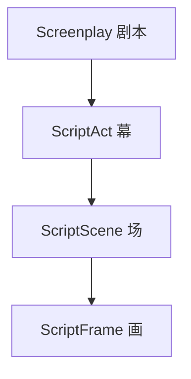
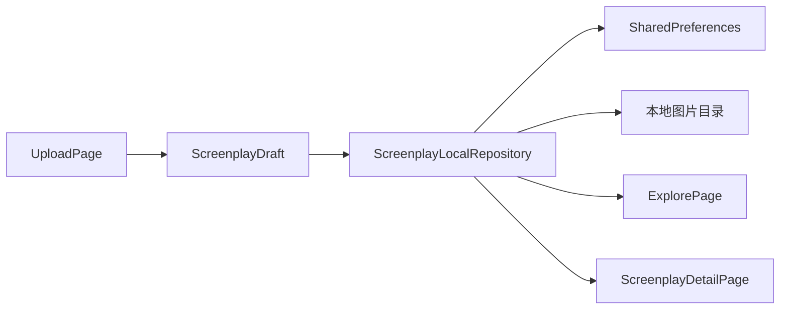

# rc0

本地剧本（姿势参考）管理与浏览工具，基于 Flutter 构建，支持 Android、iOS、桌面与 Web。

仓库：[https://github.com/qianNya/rc0.git](https://github.com/qianNya/rc0.git)

## 核心领域模型

rc0 用四层嵌套结构组织摄影参考内容：

| 层级 | 类型 | 说明 |
|------|------|------|
| 剧本 | `Screenplay` | 完整发布单元，含标题、简介、标签 |
| 幕 | `ScriptAct` | 剧本大段落 |
| 场 | `ScriptScene` | 幕内场景 |
| 画 | `ScriptFrame` | 单张参考图及说明 |



关键类型定义：

- [`lib/core/domain/screenplay/screenplay.dart`](lib/core/domain/screenplay/screenplay.dart)
- [`lib/core/domain/screenplay/script_act.dart`](lib/core/domain/screenplay/script_act.dart)
- [`lib/core/domain/screenplay/script_scene.dart`](lib/core/domain/screenplay/script_scene.dart)
- [`lib/core/domain/screenplay/script_frame.dart`](lib/core/domain/screenplay/script_frame.dart)

[`screenplay_adapter.dart`](lib/core/domain/screenplay/screenplay_adapter.dart) 负责将旧版 `PoseItem` 数据迁移为四层剧本结构。

## 功能模块

| 模块 | 路由 | 状态 | 说明 |
|------|------|------|------|
| 探索 | `/` | 已实现 | 本地剧本列表、标签筛选、删除 |
| 上传/编辑 | `/upload`、`/upload?edit={id}` | 已实现 | 分层编辑器，发布与更新 |
| 剧本详情 | `/script/:id` | 已实现 | 幕/场展开、编辑入口、图片预览 |
| 社区 | `/community` | 已实现 | 推荐模板、分类筛选、剧本入口 |
| 收藏 | `/favorites` | 已实现 | 图片收藏与剧本收藏 |
| 任务 | `/tasks` | 占位 | 空状态 UI |
| 个人 | `/profile` | 已实现 | 资料、作品、点赞、设置与更新 |

### 交互亮点

- **全屏图片预览**：双指缩放、左右切换、键盘 ←/→/Esc 导航，未放大时点击图片关闭（[`image_preview.dart`](lib/shared/widgets/image_preview.dart)）
- **桌面无边框窗口**：自定义标题栏，支持拖动、最小化、最大化、关闭（[`desktop_title_bar.dart`](lib/features/shell/presentation/widgets/desktop_title_bar.dart)）
- **响应式布局**：移动端底部导航，桌面端侧边栏（[`adaptive_shell_page.dart`](lib/features/shell/presentation/pages/adaptive_shell_page.dart)）

## 项目架构

采用 **Feature-first + 共享层** 组织代码：

```
lib/
├── main.dart                 # 入口：窗口初始化、Repository 预热
├── app/                      # 应用壳：主题、路由、导航工具
├── core/                     # 领域模型、网络辅助、常量、响应式、平台判断
├── features/                 # 按功能分包（explore / screenplay / upload / shell …）
└── shared/widgets/           # 跨功能 UI 组件
```

### 架构要点

- **路由**：`go_router` + `StatefulShellRoute`，定义于 [`app_router.dart`](lib/app/router/app_router.dart)
- **状态/数据**：Repository 单例 + `ChangeNotifier`，页面通过 `addListener` 响应数据变化
- **存储**：元数据写入 `SharedPreferences`（key: `rc0_screenplays`）；图片文件保存在 `documents/screenplays/{id}/frames/`
- **响应式**：`Breakpoints`（宽度 ≥ 1024px 视为桌面）+ `ResponsiveBuilder`



## 技术栈

| 依赖 | 用途 |
|------|------|
| `go_router` | 声明式路由与 Shell 导航 |
| `shared_preferences` | 剧本元数据持久化 |
| `path_provider` | 应用文档目录访问 |
| `file_picker` / `image_picker` | 图片选择 |
| `window_manager` | 桌面无边框窗口（Windows / macOS / Linux） |

环境要求：Dart SDK `^3.12.2`（见 [`pubspec.yaml`](pubspec.yaml)）。

## 平台支持

| 平台 | 支持情况 |
|------|----------|
| Android / iOS | 完整本地存储与选图 |
| Windows / macOS / Linux | 自定义标题栏、无边框窗口 |
| Web | 可运行；本地文件系统能力受限 |

## 开发与构建

```bash
flutter pub get
flutter run                    # 选择目标设备
flutter test
flutter analyze
flutter build apk --release    # 输出 build/app/outputs/flutter-apk/app-release.apk
```

## 已知限制

- 任务页暂无真实后端，仅展示空状态 UI
- Android Release 构建当前使用 debug 签名，上架应用商店需配置正式 keystore
- 旧路由 `/pose/:id` 自动重定向到 `/script/:id`
