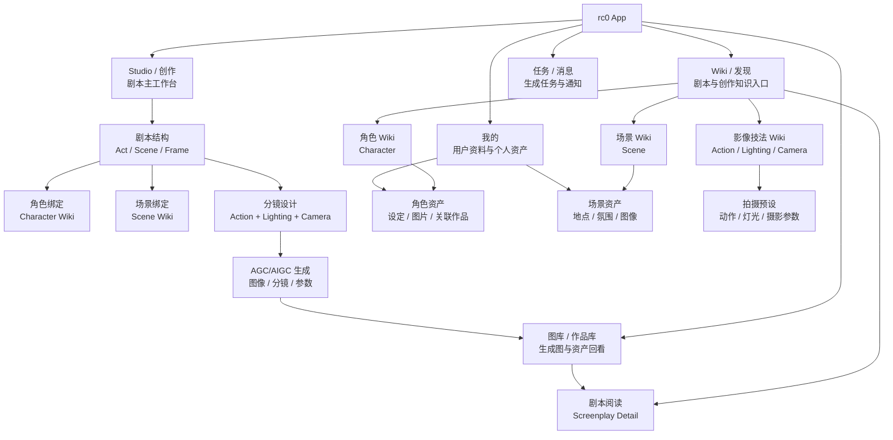
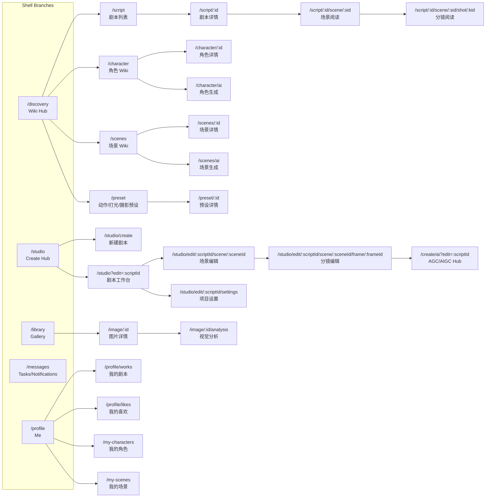

# rc0 页面路由网与 Agent 页面结构

> 产品核心：**剧本 Screenplay** 是主干；**角色 Wiki**、**场景 Scene**、**动作 Action**、**打光 Lighting**、**摄影 Cinematography**、**AGC/AIGC 生成** 是围绕剧本创作与视觉化生产的能力层。本文用于统一产品页面信息架构、路由语义，以及 Agent 后续识别页面时可依赖的结构化描述。

## 1) 产品信息架构



## 2) 路由网设计原则

- **剧本优先**：所有创作、阅读、资产关联都能回到 `screenplay_id` 或当前草稿。
- **Wiki 是资产入口**：角色、场景、动作、打光、摄影是可复用知识/资产，不只是某个编辑页里的表单字段。
- **Studio 是生产入口**：生成、编辑、同步、发布尽量发生在 Studio 工作台，不散落到多个独立流程。
- **Frame 是视觉生产最小单元**：动作、打光、摄影、AGC 参数最终都落在 `frame` 或 `scene` 上。
- **路由可读**：列表页用复数/集合语义，详情页用 `/:id`，编辑页用 `/edit`，AI 入口用 `/ai`。
- **当前代码兼容**：目标语义优先复用现有 `AppRoutes`，缺失页面先标为 `target`，不强行改路由。

## 3) 目标路由总图



## 4) Agent 页面识别字段

Agent 识别页面时，优先读取以下字段。新增页面文档也应保持同一结构。

```yaml
page_id: 稳定页面 ID，使用 kebab-case
route: 主要路由路径
route_state: implemented | redirect | coming_soon | target
shell_level: shell_branch | root_stack | nested_stack | modal_sheet
product_domain: screenplay | character_wiki | scene_wiki | action | lighting | cinematography | agc | gallery | user
primary_entity: screenplay | act | scene | frame | character | scene_asset | preset | image | user
feature_owner: lib/features/{feature}
screen_widget: 主要 Page Widget
data_owner: 主要 Repository / Service
entry_from: 常见入口
next_actions: 页面允许跳转或触发的核心动作
agent_notes: Agent 修改或生成页面时必须理解的约束
```

## 5) Shell Branch 页面

### `wiki-home`

```yaml
page_id: wiki-home
route: /discovery
route_state: implemented
shell_level: shell_branch
product_domain: screenplay
primary_entity: screenplay
feature_owner: lib/features/explore
screen_widget: ExplorePage
data_owner: FeedRepository
entry_from:
  - app_start
  - bottom_nav: Wiki
  - desktop_sidebar: Wiki
next_actions:
  - open_screenplay_list
  - open_screenplay_detail
  - open_character_wiki
  - open_scene_wiki
  - open_preset_picker
  - search_global
agent_notes:
  - 这是产品首页，不只是推荐流。
  - 应突出剧本、角色 Wiki、场景 Wiki、影像技法入口。
  - 不在本页直接执行创作保存或发布。
```

### `gallery-home`

```yaml
page_id: gallery-home
route: /library
route_state: implemented
shell_level: shell_branch
product_domain: gallery
primary_entity: image
feature_owner: lib/features/gallery
screen_widget: MyGalleryPage
data_owner: ImageGalleryRepository, ImageFavoriteRepository
entry_from:
  - bottom_nav: 图库
  - generated_image_result
  - profile_works
next_actions:
  - open_image_detail
  - open_image_analysis
  - open_related_screenplay
  - toggle_favorite
agent_notes:
  - 图库是 AGC/AIGC 结果回看与资产沉淀页。
  - 图片应尽量能追溯到剧本、场景、分镜或角色。
```

### `studio-home`

```yaml
page_id: studio-home
route: /studio
route_state: implemented
shell_level: shell_branch
product_domain: screenplay
primary_entity: screenplay
feature_owner: lib/features/studio
screen_widget: ScriptStudioPage
data_owner: ScreenplayLocalRepository, ScreenplayRemoteRepository
entry_from:
  - create_capsule
  - desktop_sidebar: create
next_actions:
  - create_screenplay
  - edit_recent_screenplay
  - open_agc_hub
agent_notes:
  - Studio 是创作入口，不是普通内容列表页。
  - 新建、继续编辑、导入草稿应从这里发起。
```

### `messages-home`

```yaml
page_id: messages-home
route: /messages
route_state: coming_soon
shell_level: shell_branch
product_domain: user
primary_entity: task
feature_owner: lib/features/tasks
screen_widget: ProfileComingSoonPage
data_owner: none
entry_from:
  - bottom_nav: 通知
next_actions:
  - open_generation_task
  - open_system_message
agent_notes:
  - 目标上应承载生成任务、审核状态、同步状态和系统通知。
```

### `profile-home`

```yaml
page_id: profile-home
route: /profile
route_state: implemented
shell_level: shell_branch
product_domain: user
primary_entity: user
feature_owner: lib/features/profile
screen_widget: ProfilePage
data_owner: AuthRepository, UserProfileRepository
entry_from:
  - bottom_nav: 我的
next_actions:
  - open_profile_works
  - open_profile_likes
  - open_profile_edit
  - open_my_characters
  - open_my_scenes
agent_notes:
  - 个人中心展示用户资产，不承担剧本主编辑职责。
```

## 6) 剧本主干页面

### `screenplay-list`

```yaml
page_id: screenplay-list
route: /script
route_state: implemented
shell_level: root_stack
product_domain: screenplay
primary_entity: screenplay
feature_owner: lib/features/community
screen_widget: CommunityPage
data_owner: FeedRepository, UserScreenplaysRepository
entry_from:
  - wiki-home
  - legacy_redirect: /wiki/script
next_actions:
  - open_screenplay_detail
  - filter_by_tag
  - search_screenplay
agent_notes:
  - 当前实现复用 CommunityPage，目标语义应是剧本 Wiki 列表。
  - 后续可独立为 ScreenplayListPage。
```

### `screenplay-detail`

```yaml
page_id: screenplay-detail
route: /script/:id
route_state: implemented
shell_level: root_stack
product_domain: screenplay
primary_entity: screenplay
feature_owner: lib/features/screenplay
screen_widget: ScreenplayDetailPage
data_owner: ScreenplayRemoteRepository, ScreenplayFavoriteRepository
entry_from:
  - screenplay-list
  - wiki-home
  - gallery-related-link
  - user-profile
next_actions:
  - read_scene
  - read_frame
  - favorite_screenplay
  - edit_in_studio
  - export_screenplay
agent_notes:
  - 这是剧本消费详情页，不应直接承载复杂编辑器状态。
  - 展示结构应围绕 Act -> Scene -> Frame。
```

### `screenplay-scene-read`

```yaml
page_id: screenplay-scene-read
route: /script/:id/scene/:sid
route_state: coming_soon
shell_level: root_stack
product_domain: screenplay
primary_entity: scene
feature_owner: lib/features/screenplay
screen_widget: ProfileComingSoonPage
data_owner: ScreenplayRemoteRepository
entry_from:
  - screenplay-detail
next_actions:
  - read_frame
  - open_scene_wiki_detail
  - edit_scene_in_studio
agent_notes:
  - 阅读态场景页，区别于 Studio 内的场景编辑页。
```

### `screenplay-frame-read`

```yaml
page_id: screenplay-frame-read
route: /script/:id/scene/:sid/shot/:kid
route_state: coming_soon
shell_level: root_stack
product_domain: screenplay
primary_entity: frame
feature_owner: lib/features/screenplay
screen_widget: ProfileComingSoonPage
data_owner: ScreenplayRemoteRepository, FrameGenerationRepository
entry_from:
  - screenplay-scene-read
  - screenplay-detail
next_actions:
  - open_generated_image
  - open_image_analysis
  - edit_frame_in_studio
agent_notes:
  - 阅读态分镜页，重点展示画面、动作、打光、摄影和生成结果。
```

## 7) 角色 Wiki 页面

### `character-wiki-list`

```yaml
page_id: character-wiki-list
route: /character
route_state: implemented
shell_level: root_stack
product_domain: character_wiki
primary_entity: character
feature_owner: lib/features/character
screen_widget: CharacterListPage
data_owner: CharacterRepository
entry_from:
  - wiki-home
  - screenplay-detail
  - studio-editor
  - route_query: work_id
next_actions:
  - open_character_detail
  - create_character
  - create_character_with_ai
  - bind_character_to_work
agent_notes:
  - 角色 Wiki 是可复用资产库。
  - 当存在 work_id 时，页面语义是某作品下的角色选择/管理。
```

### `character-detail`

```yaml
page_id: character-detail
route: /character/:id
route_state: implemented
shell_level: root_stack
product_domain: character_wiki
primary_entity: character
feature_owner: lib/features/character
screen_widget: CharacterDetailPage
data_owner: CharacterRepository
entry_from:
  - character-wiki-list
  - screenplay-detail
  - frame-editor
next_actions:
  - edit_character
  - view_related_works
  - use_in_screenplay
agent_notes:
  - 角色详情应服务于设定理解、创作复用和视觉一致性。
```

### `character-create`

```yaml
page_id: character-create
route: /character/create
route_state: implemented
shell_level: root_stack
product_domain: character_wiki
primary_entity: character
feature_owner: lib/features/character
screen_widget: CharacterCreatePage
data_owner: CharacterRepository
entry_from:
  - character-wiki-list
  - character-ai
  - studio-editor
next_actions:
  - save_character
  - attach_to_work
  - open_character_detail
agent_notes:
  - 支持通过 summary、cover、work_id 初始化。
```

### `character-ai`

```yaml
page_id: character-ai
route: /character/ai
route_state: implemented
shell_level: root_stack
product_domain: agc
primary_entity: character
feature_owner: lib/features/character
screen_widget: CharacterAiPage
data_owner: CharacterRepository
entry_from:
  - character-wiki-list
  - studio-editor
next_actions:
  - generate_character_profile
  - create_character
agent_notes:
  - 这是角色设定生成入口，结果应沉淀为 Character Wiki 资产。
```

## 8) 场景与影像技法页面

### `scene-wiki-list`

```yaml
page_id: scene-wiki-list
route: /scenes
route_state: implemented
shell_level: root_stack
product_domain: scene_wiki
primary_entity: scene_asset
feature_owner: lib/features/scene
screen_widget: SceneListPage
data_owner: SceneRepository
entry_from:
  - wiki-home
  - studio-editor
next_actions:
  - open_scene_detail
  - create_scene
  - create_scene_with_ai
  - bind_scene_to_screenplay_scene
agent_notes:
  - 场景 Wiki 表示可复用空间/地点/氛围资产，不等同于剧本里的 Scene 节点。
```

### `scene-detail`

```yaml
page_id: scene-detail
route: /scenes/:id
route_state: implemented
shell_level: root_stack
product_domain: scene_wiki
primary_entity: scene_asset
feature_owner: lib/features/scene
screen_widget: SceneDetailPage
data_owner: SceneRepository
entry_from:
  - scene-wiki-list
  - studio-scene-editor
next_actions:
  - edit_scene_asset
  - use_in_screenplay
  - view_related_images
agent_notes:
  - 资产详情页，不承载具体剧本场次的全部编辑状态。
```

### `scene-ai`

```yaml
page_id: scene-ai
route: /scenes/ai
route_state: implemented
shell_level: root_stack
product_domain: agc
primary_entity: scene_asset
feature_owner: lib/features/scene
screen_widget: SceneAiPage
data_owner: SceneRepository
entry_from:
  - scene-wiki-list
  - studio-editor
next_actions:
  - generate_scene_asset
  - create_scene
agent_notes:
  - 这是场景资产生成入口，结果应沉淀为 Scene Wiki 资产。
```

### `preset-picker`

```yaml
page_id: preset-picker
route: /preset
route_state: implemented
shell_level: root_stack
product_domain: cinematography
primary_entity: preset
feature_owner: lib/features/screenplay
screen_widget: ShootPresetPickerPage
data_owner: ShootPresetRepository
entry_from:
  - studio-editor
  - frame-editor
  - wiki-home
route_query:
  - mode: select | manage
  - scope: screenplay | scene | frame
  - act: optional int
  - scene: optional int
  - frame: optional int
next_actions:
  - select_preset
  - create_preset
  - edit_preset
agent_notes:
  - 当前预设是动作、打光、摄影参数的统一入口。
  - 如果后续拆分 Action/Lighting/Camera Wiki，应先保持与 preset 的映射关系。
```

### `action-wiki`

```yaml
page_id: action-wiki
route: /action
route_state: target
shell_level: root_stack
product_domain: action
primary_entity: preset
feature_owner: lib/features/screenplay
screen_widget: ActionWikiPage
data_owner: ShootPresetRepository
entry_from:
  - wiki-home
  - frame-editor
next_actions:
  - select_action_preset
  - apply_to_frame
agent_notes:
  - 目标页面。当前可先由 /preset?scope=frame 承载。
```

### `lighting-wiki`

```yaml
page_id: lighting-wiki
route: /lighting
route_state: target
shell_level: root_stack
product_domain: lighting
primary_entity: preset
feature_owner: lib/features/screenplay
screen_widget: LightingWikiPage
data_owner: ShootPresetRepository
entry_from:
  - wiki-home
  - frame-editor
next_actions:
  - select_lighting_preset
  - apply_to_frame
agent_notes:
  - 目标页面。当前可先由 /preset?scope=frame 承载。
```

### `camera-wiki`

```yaml
page_id: camera-wiki
route: /camera
route_state: target
shell_level: root_stack
product_domain: cinematography
primary_entity: preset
feature_owner: lib/features/screenplay
screen_widget: CameraWikiPage
data_owner: ShootPresetRepository
entry_from:
  - wiki-home
  - frame-editor
next_actions:
  - select_camera_preset
  - apply_to_frame
agent_notes:
  - 目标页面。当前可先由 /preset?scope=frame 承载。
```

## 9) Studio 创作页面

### `studio-create`

```yaml
page_id: studio-create
route: /studio/create
route_state: implemented
shell_level: nested_stack
product_domain: screenplay
primary_entity: screenplay
feature_owner: lib/features/studio
screen_widget: ScriptStudioCreatePage
data_owner: ScreenplayLocalRepository, ScreenplayPublishService
entry_from:
  - studio-home
  - create_capsule
next_actions:
  - edit_script_tree
  - open_project_settings
  - open_scene_editor
  - open_frame_editor
  - publish_screenplay
agent_notes:
  - 新建剧本和编辑剧本当前复用同一页面组件。
  - 页面内状态是创作草稿，不应被阅读详情页直接复用。
```

### `studio-edit`

```yaml
page_id: studio-edit
route: /studio?edit=:scriptId
route_state: implemented
shell_level: shell_branch
product_domain: screenplay
primary_entity: screenplay
feature_owner: lib/features/studio
screen_widget: ScriptStudioCreatePage
data_owner: ScreenplayLocalRepository, ScreenplayRemoteRepository, ScreenplayPublishService
entry_from:
  - profile-works
  - screenplay-detail
  - studio-home
next_actions:
  - edit_act_scene_frame_tree
  - open_studio-scene-editor
  - open_studio-frame-editor
  - open_project_settings
  - sync_remote
  - publish_screenplay
agent_notes:
  - 这是剧本生产主页面。
  - 角色、场景、动作、打光、摄影、AGC 都应从这里挂接到 Scene/Frame。
```

### `studio-scene-editor`

```yaml
page_id: studio-scene-editor
route: /studio/edit/:scriptId/scene/:sceneId
route_state: implemented
shell_level: root_stack
product_domain: screenplay
primary_entity: scene
feature_owner: lib/features/upload
screen_widget: SceneEditorDetailPage
data_owner: ScreenplayLocalRepository, SceneRepository, CharacterRepository
entry_from:
  - studio-edit
next_actions:
  - edit_scene_summary
  - bind_scene_asset
  - bind_characters
  - manage_frames
  - open_frame_editor
  - apply_scene_preset
agent_notes:
  - 这是剧本内 Scene 节点编辑页，不是 Scene Wiki 资产详情页。
  - 缺少 extra actions 时会回退到 ScriptStudioCreatePage。
```

### `studio-frame-editor`

```yaml
page_id: studio-frame-editor
route: /studio/edit/:scriptId/scene/:sceneId/frame/:frameId
route_state: implemented
shell_level: root_stack
product_domain: agc
primary_entity: frame
feature_owner: lib/features/upload
screen_widget: FrameEditorDetailPage
data_owner: FrameGenerationRepository, DataUploadRepository, ShootPresetRepository
entry_from:
  - studio-edit
  - studio-scene-editor
next_actions:
  - edit_action
  - edit_lighting
  - edit_camera_params
  - select_preset
  - generate_frame_image
  - upload_reference_image
  - open_generated_image
agent_notes:
  - Frame 是动作、打光、摄影、AGC 参数的最小落点。
  - 新增 AGC 功能优先接入这里，而不是另建孤立生成页。
```

### `studio-settings`

```yaml
page_id: studio-settings
route: /studio/edit/:scriptId/settings
route_state: implemented
shell_level: root_stack
product_domain: screenplay
primary_entity: screenplay
feature_owner: lib/features/upload
screen_widget: ProjectSettingsPage
data_owner: ScreenplayTagsRepository, ShootPresetRepository
entry_from:
  - studio-edit
next_actions:
  - edit_title
  - edit_synopsis
  - set_cover
  - edit_screenplay_tags
  - edit_global_shoot_params
agent_notes:
  - 项目级参数放这里，Scene/Frame 级参数放对应编辑页。
```

### `agc-hub`

```yaml
page_id: agc-hub
route: /create/ai
route_state: implemented
shell_level: root_stack
product_domain: agc
primary_entity: screenplay
feature_owner: lib/features/upload
screen_widget: AiCreationHubPage
data_owner: FrameGenerationRepository, DataUploadRepository
entry_from:
  - studio-home
  - studio-edit
  - studio-frame-editor
next_actions:
  - generate_character
  - generate_scene
  - generate_frame_image
  - open_task
agent_notes:
  - AGC Hub 是生成能力集合页。
  - 生成结果必须尽量回写到 character、scene_asset、frame 或 gallery。
```

## 10) 用户与资产回看页面

### `profile-works`

```yaml
page_id: profile-works
route: /profile/works
route_state: implemented
shell_level: root_stack
product_domain: user
primary_entity: screenplay
feature_owner: lib/features/profile
screen_widget: ProfileWorksPage
data_owner: ScreenplayLocalRepository, UserScreenplaysRepository
entry_from:
  - profile-home
next_actions:
  - open_screenplay_detail
  - edit_in_studio
agent_notes:
  - 个人剧本资产入口，适合承载本地草稿与远端作品的统一入口。
```

### `my-characters`

```yaml
page_id: my-characters
route: /my-characters
route_state: implemented
shell_level: root_stack
product_domain: character_wiki
primary_entity: character
feature_owner: lib/features/character
screen_widget: MyCharactersPage
data_owner: CharacterRepository
entry_from:
  - profile-home
next_actions:
  - open_character_detail
  - create_character
agent_notes:
  - 用户私有角色资产列表。
```

### `my-scenes`

```yaml
page_id: my-scenes
route: /my-scenes
route_state: implemented
shell_level: root_stack
product_domain: scene_wiki
primary_entity: scene_asset
feature_owner: lib/features/scene
screen_widget: MyScenesPage
data_owner: SceneRepository
entry_from:
  - profile-home
next_actions:
  - open_scene_detail
  - create_scene
agent_notes:
  - 用户私有场景资产列表。
```

## 11) 推荐页面层级

| 层级 | 页面类型 | 示例 | 说明 |
|---|---|---|---|
| L1 | Shell 主入口 | `/discovery`、`/studio`、`/library`、`/profile` | 用户心智入口，数量保持少 |
| L2 | 领域列表/Hub | `/script`、`/character`、`/scenes`、`/preset` | Wiki 与资产集合 |
| L3 | 详情/编辑 | `/script/:id`、`/character/:id`、`/scenes/:id` | 读、用、关联 |
| L4 | Studio 工作页 | `/studio/edit/.../scene/...`、`/frame/...` | 创作生产，不作为普通浏览入口 |
| L5 | Sheet/Picker | 角色选择、预设选择、参数选择 | 轻量选择，不独立承担业务主线 |

## 12) Agent 修改页面时的判定规则

- 如果需求提到“剧本、章节、场次、分镜、发布、同步”，优先定位 `screenplay`、`studio`、`upload`。
- 如果需求提到“角色设定、人物、角色图、角色关联”，优先定位 `character_wiki`。
- 如果需求提到“场景设定、地点、空间、氛围、环境图”，优先定位 `scene_wiki`。
- 如果需求提到“动作、姿态、运动、走位”，优先定位 `action`；当前多半落在 `studio-frame-editor` 或 `preset-picker`。
- 如果需求提到“灯光、光比、色温、影调、氛围光”，优先定位 `lighting`；当前多半落在 `studio-frame-editor` 或 `preset-picker`。
- 如果需求提到“镜头、焦段、景别、机位、摄影参数”，优先定位 `cinematography`；当前多半落在 `studio-frame-editor` 或 `preset-picker`。
- 如果需求提到“生成、AI、AIGC、AGC、图片生成、视觉分析”，优先定位 `agc`；生成结果要回写到剧本、角色、场景、分镜或图库。
- 如果页面是阅读态，不要引入复杂编辑草稿状态；如果页面是 Studio 编辑态，不要绕过 `ScreenplayLocalRepository` 和相关 service。
