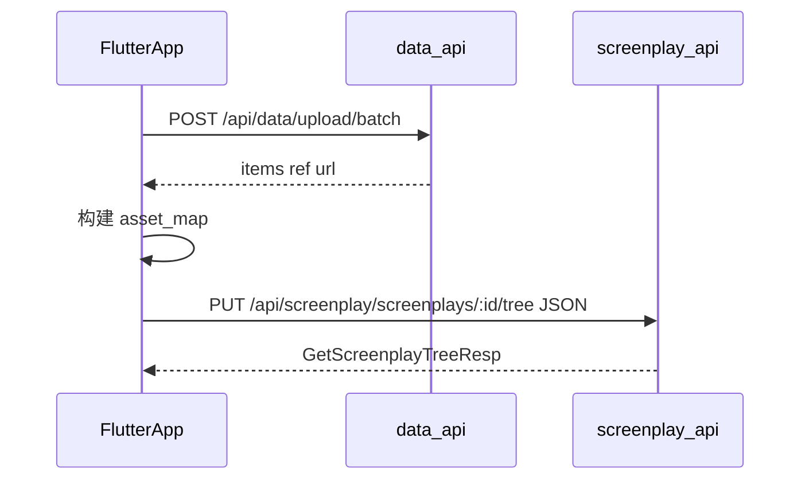
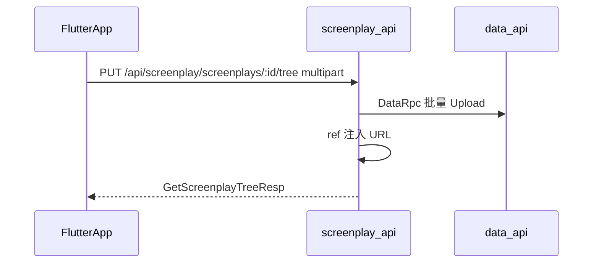

# ScreenplayTree 接口文档

> 剧本树聚合 CRUD + 批量上传整合  
> 契约来源：`rc0-go/service/screenplay/api/screenplay.api`、`rc0-go/service/data/api/data.api`  
> 生成客户端：`lib/api/screenplay`、`lib/api/data`（`make dart-client`）  
> HTTP 联调：`lib/api/http/screenplay/screenplay.http`、`lib/api/http/data/data.http`

---

## 1. 通用约定

| 项 | 说明 |
|----|------|
| 基址 | `ApiConfig.serverHost`（Gateway，默认 `http://127.0.0.1:8888`） |
| 鉴权 | `Authorization: Bearer <access_token>`（除 ping 外均需登录） |
| 响应信封 | `{ "code": 0, "data": ..., "msg": "ok" }` |
| 写权限 | 树保存 / 删除 / `tree/assets` 要求当前用户为 `sp_screenplay.creator`；`admin` 可旁路 |
| JSON 命名 | HTTP 使用 `snake_case`；Dart DTO 使用 `camelCase` |

---

## 2. 端到端流程

### 模式 A：分步（预上传 + JSON 保存）

适合调试、大文件分批上传。



### 模式 B：一步（multipart 整合）

适合编辑器单次提交。



---

## 3. 接口一览

| 方法 | 路径 | 说明 |
|------|------|------|
| POST | `/api/data/upload/batch` | 批量上传，返回 ref→url |
| GET | `/api/screenplay/screenplays/:id/tree` | 分级懒加载查询 |
| PUT | `/api/screenplay/screenplays/:id/tree` | 保存树（diff） |
| POST | `/api/screenplay/screenplays/:id/tree` | 追加子树 |
| DELETE | `/api/screenplay/screenplays/:id/tree` | 清空 act/scene/frame |
| POST | `/api/screenplay/screenplays/:id/tree/assets` | 剧本域批量上传 |

---

## 4. 批量上传

### 4.1 `POST /api/data/upload/batch`

**Content-Type：** `multipart/form-data`

| 字段 | 必填 | 说明 |
|------|------|------|
| `files` | 是 | 多文件，字段名均为 `files` |
| `refs` | 否 | JSON 数组字符串，与 files 顺序一一对应；缺省为 `upload-0`、`upload-1`… |

**限制：**

- 单批最多 **20** 个文件
- 单文件 ≤ **64MB**
- 批次总大小 ≤ **128MB**
- 任一项失败则**整批失败**

**响应 `data`：**

```json
{
  "items": [
    {
      "ref": "cover-1",
      "url": "https://cdn/.../abc.jpg",
      "md5": "...",
      "filename": "cover.jpg",
      "object_key": "...",
      "bucket": "...",
      "storage": "minio",
      "size": 12345,
      "deduplicated": false
    }
  ]
}
```

### 4.2 `POST /api/screenplay/screenplays/:id/tree/assets`

multipart 字段与 4.1 相同。额外校验剧本存在且当前用户有写权限。响应 `data.items` 结构同 `BatchUploadItem`。

---

## 5. 树查询

### `GET /api/screenplay/screenplays/:id/tree`

**Query 参数：**

| 参数 | 默认 | 含义 |
|------|------|------|
| `depth` | `3` | `0` 仅 screenplay；`1` +acts；`2` +scenes；`3` +frames |
| `act_page` | `1` | acts 页码 |
| `act_page_size` | `0` | `0` = 该层全量（向后兼容） |
| `scene_page` / `scene_page_size` | `1` / `0` | 每个 act 下 scenes 分页 |
| `frame_page` / `frame_page_size` | `1` / `0` | 每个 scene 下 frames 分页 |

**示例：**

```http
GET /api/screenplay/screenplays/1/tree?depth=2&act_page=1&act_page_size=10
```

**响应结构 `GetScreenplayTreeResp`：**

```json
{
  "screenplay": { "id": 1, "title": "...", "cover_url": "...", "act_count": 2 },
  "acts": [
    {
      "act": { "id": 10, "title": "第一幕", "sort": 1 },
      "scenes": [
        {
          "scene": { "id": 20, "title": "第一场", "sort": 1 },
          "frames": [
            { "id": 30, "title": "分镜 1", "image_url": "https://..." }
          ],
          "frame_page": { "page": 1, "page_size": 20, "total": 1 }
        }
      ],
      "scene_page": { "page": 1, "page_size": 5, "total": 1 }
    }
  ],
  "act_page": { "page": 1, "page_size": 10, "total": 2 }
}
```

**树 JSON 形状（写请求同构）：**

- `acts[].act` — 幕节点
- `acts[].scenes[].scene` — 场节点
- `acts[].scenes[].frames[]` — **扁平** Frame 数组（非 `FrameNode` 包装）

---

## 6. 树写入

### 6.1 ref 与 URL 规则

| 节点 | 持久化字段 | 写请求 ref 字段（不入库） |
|------|------------|---------------------------|
| Screenplay | `cover_url` | `cover_ref` |
| Frame | `image_url` | `image_ref` |
| Frame | `thumbnail_url` | `thumbnail_ref` |

规则：

1. `*_ref` 非空且对应 `*_url` 为空 → 从 `asset_map` 或本次 multipart 上传结果解析 URL
2. `*_url` 已有值 → **以 url 为准**，忽略 ref（保留旧图）
3. ref 在 `asset_map` 与本次上传中均找不到 → `400 invalid asset ref`

### 6.2 `PUT /api/screenplay/screenplays/:id/tree`（Save / diff）

支持两种 Content-Type：

| Content-Type | 行为 |
|--------------|------|
| `application/json` | 提交 `SaveScreenplayTreeReq`；可含 `asset_map` |
| `multipart/form-data` | part `tree`（JSON 字符串）+ `files` + optional `refs` |

**JSON 请求示例：**

```json
{
  "asset_map": {
    "cover-ref": "https://cdn/.../cover.jpg",
    "frame-ref": "https://cdn/.../frame.jpg"
  },
  "screenplay": {
    "title": "树保存示例",
    "cover_ref": "cover-ref"
  },
  "acts": [
    {
      "act": { "title": "第一幕", "sort": 1 },
      "scenes": [
        {
          "scene": { "title": "第一场", "sort": 1 },
          "frames": [
            { "title": "分镜 1", "sort": 1, "image_ref": "frame-ref" }
          ]
        }
      ]
    }
  ],
  "version": 0
}
```

**diff 语义：**

- payload 中**缺失**的已有节点 → 软删除（级联子节点）
- `id <= 0` 或未传 id → 新建
- 保存后重算 `act_count` / `scene_count` / `frame_count`
- 响应为完整树 `GetScreenplayTreeResp`

**multipart 字段：**

| part | 说明 |
|------|------|
| `tree` | `SaveScreenplayTreeReq` 的 JSON 字符串（可含 `*_ref`） |
| `files` | 与 batch 上传相同 |
| `refs` | 可选 JSON 数组，与 files 顺序对应 |

### 6.3 `POST /api/screenplay/screenplays/:id/tree`（Create）

请求体与 PUT 相同（JSON 或 multipart）。在已有剧本下**追加**树结构，不替换整棵树。

### 6.4 `DELETE /api/screenplay/screenplays/:id/tree`

软删除该剧本下全部 act / scene / frame，**不删除** `sp_screenplay` 主体；计数归零。

---

## 7. 错误码

| 场景 | 表现 |
|------|------|
| 未登录 | `401` |
| 非剧本 creator | `403` |
| 剧本不存在 | `404` |
| invalid asset ref | `400` |
| multipart 缺 `tree` / `files` | `400` |
| 文件超限 | `400` |

---

## 8. Flutter 接入

### 8.1 生成 API 对照

| 场景 | `lib/api` 函数 | DTO |
|------|----------------|-----|
| 读树 | `getScreenplayTree(id)` | `GetScreenplayTreeResp` |
| 保存树 JSON | `saveScreenplayTree(id, SaveScreenplayTreeReq)` | `SaveScreenplayTreeReq` |
| 追加树 | `createScreenplayTree(id, SaveScreenplayTreeReq)` | 同上 |
| 清空子树 | `deleteScreenplayTree(id, DeleteScreenplayTreeReq)` | `DeleteScreenplayTreeReq` |
| 剧本内批量上传 | `batchUploadTreeAssets(id, BatchUploadTreeAssetsReq)` | `BatchUploadTreeAssetsResp` |
| 通用批量上传 | `batchUpload()` | `BatchUploadResp` |

导入路径示例：

```dart
import 'package:flutter_application_1/api/screenplay/api/screenplay-api.dart';
import 'package:flutter_application_1/api/screenplay/data/screenplay-api.dart' as sp_dto;
import 'package:flutter_application_1/core/network/api_callback.dart';
```

### 8.2 生成代码限制（须在 App 层封装）

| 限制 | 说明 | 建议 |
|------|------|------|
| PUT / DELETE | goctl Dart 将 `saveScreenplayTree` / `deleteScreenplayTree` 生成为 `apiPost` | JSON 保存/删除在 `lib/core/network/` 用 `HttpClient` 发 **PUT** / **DELETE**，或扩展 `api.dart` shim |
| 树分页 query | `getScreenplayTree` 仅接受 `id`，无 query 参数 | 懒加载时在 shim 中拼接 `?depth=&act_page_size=` |
| multipart | `batchUpload` / `batchUploadTreeAssets` 生成 stub（无 File 参数） | 已接 [`batch_upload.dart`](../lib/core/network/batch_upload.dart)；tree/assets 未接 |
| 单文件上传 | 已有 `uploadBytes` | 继续使用 `data_upload.dart` |

### 8.3 Repository 接入（已实现）

| 模块 | 实现 |
|------|------|
| `ScreenplayRemoteRepository.saveScreenplayTree` | 调用 `screenplay_tree_http.saveScreenplayTreePut` |
| `ScreenplayPublishService` | 模式 A：`tree/assets` → PUT tree；支持 `syncToServer` diff |
| `DataUploadRepository.uploadBatchForScreenplay` | 包装 `tree_assets_upload.dart`，剧本域上传 |
| `DataUploadRepository.uploadBatch` | 包装 `batch_upload.dart`（通用 data 域） |
| `ScreenplayApiMapper` | `collectLocalAssets` / `buildSaveTreePayload` / `applySaveTreeResponse` |

未接 UI：`createScreenplayTree`、`deleteScreenplayTree`、`batchUploadTreeAssets`、树分页 query。

### 8.4 保存树示例（JSON，模式 A）

```dart
import 'package:flutter_application_1/core/network/screenplay_tree_http.dart';
import 'package:flutter_application_1/features/screenplay/data/screenplay_api_mapper.dart';

final payload = ScreenplayApiMapper.buildSaveTreePayload(
  tree: document.tree,
  visibility: 1,
  assetMap: {'cover-ref': coverUrl, 'frame-0-0-0': frameUrl},
  isRepublish: false,
);

final result = await saveScreenplayTreePut(screenplayId, payload);
if (result.error != null) { /* handle */ }
final saved = result.data!;
```

> **注意：** 若后端返回 404/405，请改用 PUT 方法的自定义 HTTP 封装（见 8.2）。

---

## 9. 联调步骤

**App 首次发布（Mode A，对齐 `screenplay.http`）顺序：**

1. `POST /api/screenplay/screenplays` — 创建**草稿**壳（`publish_status: 0`，`cover_url` 可为空）
2. `POST /api/screenplay/screenplays/:id/tree/assets` — 剧本域批量上传，得到 `asset_map`
3. `PUT /api/screenplay/screenplays/:id/tree` — JSON + `asset_map` + `cover_ref` / `image_ref`，写入树

手工联调参考顺序：

1. `POST /api/auth/login` 获取 token
2. `POST /api/screenplay/screenplays` 创建剧本，记下 `id`
3. `POST /api/data/upload/batch` 或 `POST .../tree/assets`
4. `PUT .../tree`（JSON + `asset_map`）或 multipart 一步提交
5. `GET .../tree?depth=3&act_page_size=10` 验证分页

可执行用例见：

- [`lib/api/http/data/data.http`](../lib/api/http/data/data.http) — `batchUpload`
- [`lib/api/http/screenplay/screenplay.http`](../lib/api/http/screenplay/screenplay.http) — `saveScreenplayTreeJson`、`saveScreenplayTreeMultipart`

矩阵对照：[`docs/APP_API_MATRIX.md`](APP_API_MATRIX.md)
