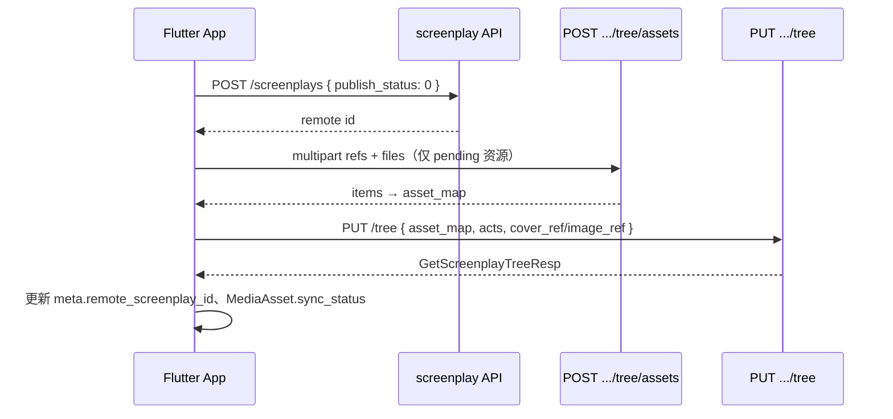
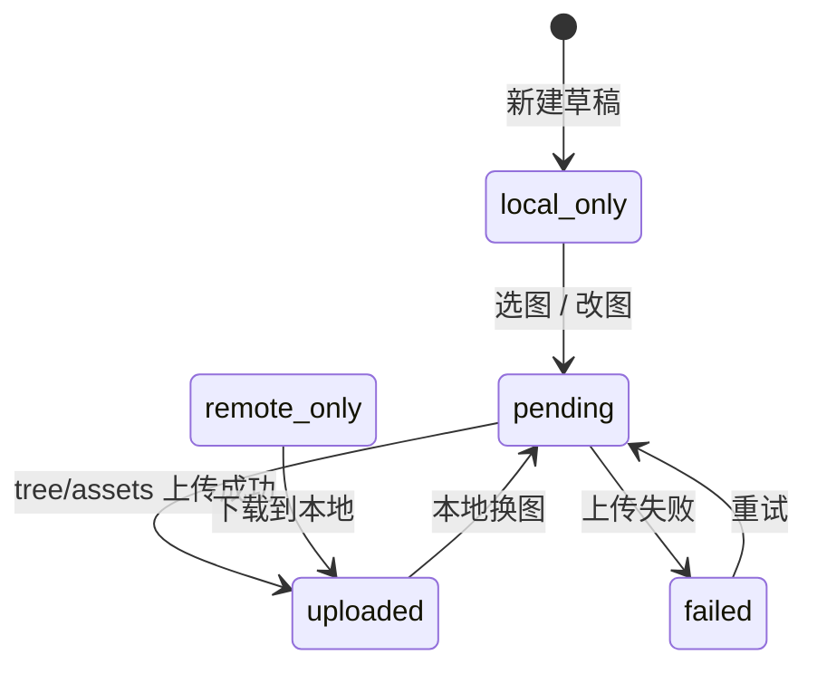

# 剧本树统一结构说明（本地 / 云端兼容）

> 目标：重构后端 API 与 App 持久化，使**同一套 tree 形状**兼容本地草稿、已发布同步、未上传与已上传图片；UI **优先使用本地路径**展示。  
> 关联文档：[`SCREENPLAY_TREE_API.md`](SCREENPLAY_TREE_API.md) · [`SCREENPLAY_LOCAL_JSON.md`](SCREENPLAY_LOCAL_JSON.md) · [`SCREENPLAY_FLOW.md`](SCREENPLAY_FLOW.md)

---

## 1. 背景与目标

当前实现中，本地 JSON 与 API 契约存在以下差异：

| 维度 | 现状 | 目标 |
|------|------|------|
| 图片字段 | 扁平分散（`cover_url` / `local_cover_path` / `image_ref` 等） | 统一为 `MediaAsset` 对象 |
| 上传状态 | 靠 url 是否为空推断 | 显式 `sync_status` 枚举 |
| 同步状态 | 靠 `meta.remote_screenplay_id` 推断 | 显式 `meta.sync_state` |
| GET 响应 | 仅含远程 url | App merge 后补全 `local_path` |
| 展示优先级 | `ScreenplayImageResolver` 已实现 | 规则不变，数据源改为 `MediaAsset` |

**设计原则：**

1. **同构 tree** — 本地持久化与 API 读写共用同一套 `tree` 节点形状（App 侧额外持有 `meta`）。
2. **图片双轨** — `local_path` 与 `remote_url` 严格分离；展示时 local 优先。
3. **ref 仅写请求** — `*_ref`、`asset_map` 只在 PUT/POST 出现，不入库、不回读。
4. **meta 仅客户端** — `local_id`、`sync_state` 等不上传服务端。

---

## 2. 文档顶层结构

App 持久化单元仍为 `ScreenplayTreeDocument`：

```json
{
  "meta": { "...客户端元数据，见 §3..." },
  "tree": { "...业务树，见 §4..." }
}
```

| 场景 | 传输内容 |
|------|----------|
| App → SharedPreferences | 完整 `{ meta, tree }` |
| API GET | 仅 `tree`（服务端不含 `local_path` / `sync_status`） |
| API PUT/POST | `tree` + 可选 `asset_map` / multipart `files` |

存储键：`rc0_screenplay_trees`（与现有一致）。

---

## 3. meta（仅 App，不上传）

### 3.1 字段

| 字段 | 类型 | 说明 |
|------|------|------|
| `local_id` | string | App 主键，如 `script-1739123456789` |
| `remote_screenplay_id` | int \| null | 数据库 ID；`null` = 未发布 |
| `sync_state` | string | 同步状态，见 §3.2 |
| `is_local` | bool | 是否本地创作 |
| `tags` | string[] | 标签 |
| `author` / `author_bio` | string | 作者信息 |
| `forked_from_id` | int \| null | Fork 来源远程 ID |
| `forked_from_local_id` | string \| null | Fork 来源本地 ID |
| `images_localized` | bool | 是否已下载图片到本地 |
| `visibility` | int \| null | 可见性 |
| `published_at` | string \| null | ISO8601 |
| `created_at` | string \| null | ISO8601 |
| `tree_json_object_key` | string \| null | 可选对象存储键 |

### 3.2 sync_state 枚举

| 值 | 含义 |
|----|------|
| `local_only` | 纯本地草稿，`remote_screenplay_id = null` |
| `published` | 已关联远程 ID，可双向同步 |
| `forked` | Fork 副本，删除不影响原稿 |
| `conflict` | 本地与服务端版本冲突（乐观锁，可选） |

---

## 4. tree 业务树

### 4.1 层级结构

```
ScreenplayTree
├── version              # 乐观锁版本号（可选，默认 0）
├── screenplay           # 剧本根节点
└── acts[]               # 幕列表
    └── ActNode
        ├── act          # 幕实体
        └── scenes[]     # 场列表
            └── SceneNode
                ├── scene    # 场实体
                └── frames[] # 画格（扁平 Frame 数组，非 FrameNode 包装）
```

与现有 API 一致：`frames[]` 为扁平 Frame，不是 `{ "frame": {...} }` 包装。

### 4.2 节点公共字段

#### screenplay

| 字段 | 类型 | 说明 |
|------|------|------|
| `id` | int | 未发布为 `0` 或伪 ID；已发布为 DB ID |
| `title` | string | 标题 |
| `summary` | string | 简介 |
| `cover` | MediaAsset | 封面，见 §5 |
| `act_count` / `scene_count` / `frame_count` | int | 计数（可冗余） |
| `publish_status` / `visibility` / `published_at` | — | 发布相关（同步时携带） |

#### act / scene

| 字段 | 类型 | 说明 |
|------|------|------|
| `id` | int | 未发布 `0`；已发布为 DB ID |
| `title` | string | 标题 |
| `summary` | string | 简介（act/scene） |
| `sort` | int | 排序 |
| `location` / `time_of_day` | string | scene 专用 |

#### frame

| 字段 | 类型 | 说明 |
|------|------|------|
| `id` | int | 未发布 `0`；已发布为 DB ID |
| `sort` | int | 排序 |
| `dialogue` | string | 台词 |
| `action_note` | string | 动作说明 |
| `image` | MediaAsset | 画格图，见 §5 |

### 4.3 ID 体系

| 场景 | `tree.screenplay.id` | `meta.remote_screenplay_id` |
|------|---------------------|----------------------------|
| 未发布 | 伪整数（时间戳） | `null` |
| 已发布 | 数据库 ID | 同左 |

`act` / `scene` / `frame` 的 `id`：未发布多为 `0`；发布后为服务端分配 ID。同步写请求（PUT）须携带已有节点 `id`。

---

## 5. MediaAsset（统一图片模型）

### 5.1 结构

```json
{
  "asset_id": "frame-0-0-0",
  "local_path": "/data/user/0/.../screenplays/script-xxx/frames/frame-0.jpg",
  "remote_url": "https://cdn.example.com/abc.jpg",
  "thumbnail_url": "https://cdn.example.com/abc-thumb.jpg",
  "sync_status": "uploaded",
  "md5": "d41d8cd98f00b204e9800998ecf8427e",
  "object_key": "screenplay/42/frame-30.jpg",
  "updated_at": "2026-06-22T10:00:00Z"
}
```

| 字段 | 持久化位置 | 说明 |
|------|-----------|------|
| `asset_id` | App + 写请求 ref | 稳定引用 ID；写请求时作为 `cover_ref` / `image_ref` |
| `local_path` | **仅 App** | 本地绝对路径；服务端不存 |
| `remote_url` | App + 服务端 | CDN / 对象存储 URL |
| `thumbnail_url` | App + 服务端 | 缩略图 URL（可选） |
| `sync_status` | **仅 App** | 上传同步状态，见 §5.2 |
| `md5` / `object_key` | 服务端（可选回传） | 去重与存储定位 |
| `updated_at` | App | 本地文件变更时间 |

本地图片目录（与现有一致）：

```
{ApplicationDocuments}/screenplays/{local_id}/frames/
```

### 5.2 sync_status 枚举

| 值 | 含义 | 典型场景 |
|----|------|----------|
| `local_only` | 仅有本地文件，未上传 | 新建草稿 |
| `pending` | 本地有变更，待上传 | 换图后未同步 |
| `uploaded` | 已上传，`remote_url` 有效 | 发布/同步完成 |
| `remote_only` | 无本地副本，仅有 CDN | Fork 后未下载 |
| `failed` | 上传失败 | 可重试 |

### 5.3 展示优先级

App 层统一规则（与现有 `ScreenplayImageResolver` 一致）：

```
1. local_path 非空且文件可读  → 使用 local_path（本地优先）
2. remote_url 非空            → 使用 remote_url
3. thumbnail_url 非空         → 缩略图兜底
4. 否则                       → null（显示占位图）
```

**UI 约定：** 当 `local_path` 有效且 `remote_url` 也非空时，显示本地图并展示 cloud 角标（已同步）。

### 5.4 与旧扁平字段的映射

过渡期 Mapper 可双读双写：

| 旧字段（现有） | 新结构 |
|-------------|--------|
| `cover_url` | `cover.remote_url` |
| `local_cover_path` | `cover.local_path` |
| `image_url` | `image.remote_url` |
| `local_image_path` | `image.local_path` |
| `local_thumbnail_path` | `image.local_path` 或 `image.thumbnail_url` 的本地副本 |
| `thumbnail_url` | `image.thumbnail_url` |
| `cover_ref` / `image_ref`（写请求） | `cover.asset_id` / `image.asset_id` |

---

## 6. 场景示例

### 6.1 未发布 + 未上传（纯本地）

```json
{
  "meta": {
    "local_id": "script-1739123456789",
    "remote_screenplay_id": null,
    "sync_state": "local_only"
  },
  "tree": {
    "version": 0,
    "screenplay": {
      "id": 0,
      "title": "我的草稿",
      "summary": "",
      "cover": {
        "asset_id": "cover-ref",
        "local_path": "/data/.../cover.jpg",
        "remote_url": "",
        "sync_status": "local_only"
      }
    },
    "acts": [{
      "act": { "id": 0, "title": "第一幕", "sort": 1 },
      "scenes": [{
        "scene": { "id": 0, "title": "第一场", "sort": 1 },
        "frames": [{
          "id": 0,
          "sort": 1,
          "dialogue": "台词 A",
          "image": {
            "asset_id": "frame-0-0-0",
            "local_path": "/data/.../frame-0.jpg",
            "remote_url": "",
            "sync_status": "local_only"
          }
        }]
      }]
    }]
  }
}
```

### 6.2 已发布 + 部分待同步（本地优先展示）

画格 `frame-0-0-1`：本地是新图，`remote_url` 仍是旧 CDN → UI 显示本地新图；同步后更新 `remote_url`，`sync_status → uploaded`。

```json
{
  "meta": {
    "local_id": "script-1739123456789",
    "remote_screenplay_id": 42,
    "sync_state": "published"
  },
  "tree": {
    "version": 3,
    "screenplay": {
      "id": 42,
      "title": "已发布剧本",
      "cover": {
        "asset_id": "cover-ref",
        "local_path": "/data/.../cover.jpg",
        "remote_url": "https://cdn.example.com/cover.jpg",
        "sync_status": "uploaded"
      }
    },
    "acts": [{
      "act": { "id": 10, "title": "第一幕", "sort": 1 },
      "scenes": [{
        "scene": { "id": 20, "title": "第一场", "sort": 1 },
        "frames": [
          {
            "id": 30,
            "sort": 1,
            "image": {
              "asset_id": "frame-0-0-0",
              "local_path": "/data/.../frame-0.jpg",
              "remote_url": "https://cdn.example.com/f30.jpg",
              "sync_status": "uploaded"
            }
          },
          {
            "id": 31,
            "sort": 2,
            "image": {
              "asset_id": "frame-0-0-1",
              "local_path": "/data/.../frame-1-new.jpg",
              "remote_url": "https://cdn.example.com/f31-old.jpg",
              "sync_status": "pending"
            }
          }
        ]
      }]
    }]
  }
}
```

### 6.3 纯远程（Fork 未下载）

```json
{
  "id": 30,
  "sort": 1,
  "dialogue": "...",
  "image": {
    "asset_id": "frame-0-0-0",
    "local_path": "",
    "remote_url": "https://cdn.example.com/f30.jpg",
    "sync_status": "remote_only"
  }
}
```

用户执行「下载到本地」后：`local_path` 填充，`sync_status → uploaded`，`meta.images_localized = true`。

---

## 7. API 契约

### 7.1 接口一览

与现有树 API 保持一致，详见 [`SCREENPLAY_TREE_API.md`](SCREENPLAY_TREE_API.md)：

| 方法 | 路径 | 说明 |
|------|------|------|
| GET | `/api/screenplay/screenplays/:id/tree` | 分级懒加载查询 |
| PUT | `/api/screenplay/screenplays/:id/tree` | 保存树（diff） |
| POST | `/api/screenplay/screenplays/:id/tree` | 追加子树 |
| DELETE | `/api/screenplay/screenplays/:id/tree` | 清空 act/scene/frame |
| POST | `/api/screenplay/screenplays/:id/tree/assets` | 剧本域批量上传 |
| POST | `/api/data/upload/batch` | 通用批量上传 |

### 7.2 GET 响应（服务端视角）

服务端**不返回** `local_path`、`sync_status`（纯客户端字段）：

```json
{
  "screenplay": {
    "id": 42,
    "title": "已发布剧本",
    "cover": {
      "remote_url": "https://cdn.example.com/cover.jpg",
      "thumbnail_url": "https://cdn.example.com/cover-thumb.jpg"
    }
  },
  "acts": [{
    "act": { "id": 10, "title": "第一幕", "sort": 1 },
    "scenes": [{
      "scene": { "id": 20, "title": "第一场", "sort": 1 },
      "frames": [{
        "id": 30,
        "sort": 1,
        "dialogue": "...",
        "image": {
          "remote_url": "https://cdn.example.com/f30.jpg",
          "thumbnail_url": "https://cdn.example.com/f30-thumb.jpg"
        }
      }]
    }]
  }],
  "version": 3
}
```

**App merge 规则（GET → 本地 document）：**

1. 按节点 `id` 匹配已有 tree 节点。
2. 更新 `remote_url` / `thumbnail_url`；**保留**已有 `local_path`。
3. 若本地无 `local_path` 且远程有 url → `sync_status = remote_only`。
4. 若本地有 path 且远程有 url → `sync_status = uploaded`。
5. 不覆盖 App 侧 `asset_id`（除非为空则从 ref 规则生成）。

### 7.3 PUT/POST 写请求

仍采用 **ref + asset_map** 模式（与现有 API 兼容）：

```json
{
  "version": 3,
  "asset_map": {
    "cover-ref": "https://cdn.example.com/cover-new.jpg",
    "frame-0-0-1": "https://cdn.example.com/f31-new.jpg"
  },
  "screenplay": {
    "title": "已发布剧本",
    "cover_ref": "cover-ref"
  },
  "acts": [{
    "act": { "id": 10, "title": "第一幕", "sort": 1 },
    "scenes": [{
      "scene": { "id": 20, "title": "第一场", "sort": 1 },
      "frames": [
        {
          "id": 30,
          "sort": 1,
          "image_url": "https://cdn.example.com/f30.jpg"
        },
        {
          "id": 31,
          "sort": 2,
          "image_ref": "frame-0-0-1"
        }
      ]
    }]
  }]
}
```

> **过渡期：** 写请求仍可使用扁平 `cover_ref` / `image_ref` / `image_url`；App 从 `MediaAsset.asset_id` 映射为 ref 字段。

#### ref 解析规则

| 规则 | 说明 |
|------|------|
| 1 | `*_ref` 非空且对应 `*_url` 为空 → 从 `asset_map` 或本次 multipart 上传结果解析 URL |
| 2 | `*_url` 已有值 → **以 url 为准**，忽略 ref（保留旧图） |
| 3 | ref 在 `asset_map` 与本次上传中均找不到 → `400 invalid asset ref` |

#### asset_id / ref 命名约定

| ref | 用途 |
|-----|------|
| `cover-ref` | 封面 |
| `frame-{actIdx}-{sceneIdx}-{frameIdx}` | 画格图（与 `ScreenplayApiMapper.frameRef` 一致） |

### 7.4 端到端发布流程（Mode A）

与 [`SCREENPLAY_FLOW.md`](SCREENPLAY_FLOW.md) 一致：



---

## 8. 同步状态机



### 8.1 待上传资源收集

等价于现有 `ScreenplayApiMapper.collectLocalAssets`，改为基于 `MediaAsset`：

```
遍历 tree 中所有 cover / frame.image
  if sync_status in [local_only, pending, failed]
     and local_path 文件存在
     and (remote_url 为空 OR 本地文件已变更)
  → 加入上传队列，ref = asset_id
```

同一本地文件多 ref 指向时，按现有逻辑 dedupe（如 cover 与 frame-0-0-0 同文件）。

### 8.2 上传成功后

1. 写入 `remote_url`（及 `thumbnail_url` 如有）。
2. 设置 `sync_status = uploaded`。
3. **保留** `local_path`（不删除本地副本）。
4. 更新 `meta.remote_screenplay_id`（首次发布时）。

### 8.3 diff 保存语义

PUT tree 时（与现有一致）：

- payload 中**缺失**的已有节点 → 软删除（级联子节点）。
- `id <= 0` 或未传 id → 新建。
- 保存后重算 `act_count` / `scene_count` / `frame_count`。

---

## 9. 后端数据库建议

服务端**不持久化**客户端字段：

| 不存 | 原因 |
|------|------|
| `local_path` | 设备相关 |
| `sync_status` | 客户端同步状态 |
| `asset_id` | 写请求 ref，非 DB 主键 |

| 表 | 图片相关列 |
|----|-----------|
| `sp_screenplay` | `cover_url`, `cover_thumb_url` |
| `sp_frame` | `image_url`, `thumbnail_url`, `image_object_key`, `image_md5` |

GET 组装为嵌套 `cover` / `image` 对象；写请求解析 ref 后只存 url 列。

---

## 10. App 模块职责

| 模块 | 职责 |
|------|------|
| `ScreenplayTreeDocument` | 持久化 `{ meta, tree }` |
| `MediaAsset`（新增） | 图片双轨 + sync_status 模型 |
| `ScreenplayImageResolver` | 展示路径解析（改为读 MediaAsset） |
| `ScreenplayApiMapper` | 扁平字段 ↔ MediaAsset；collectLocalAssets；buildSaveTreePayload；applySaveTreeResponse |
| `ScreenplayLocalRepository` | 本地 CRUD、图片落盘、downloadLocalCopy |
| `ScreenplayPublishService` | 首次发布 / syncToServer |
| `DataUploadRepository` | batchUpload / tree/assets |

### 10.1 applySaveTreeResponse 要点

响应 merge 进本地时：

- 更新远程 url 与节点 id。
- **保留** `local_path` 与 `asset_id`。
- 有 local + remote → `sync_status = uploaded`。
- 仅 remote → `sync_status = remote_only`（若本地无文件）。

---

## 11. 迁移与兼容

### 11.1 分阶段实施

| 阶段 | 内容 | API 变更 |
|------|------|----------|
| Phase 1 | App 引入 `MediaAsset`，Mapper 双读双写旧扁平字段 | 无 |
| Phase 2 | 后端 GET 响应改为嵌套 `cover` / `image`；兼容旧 flat 字段 6 个月 | 响应扩展 |
| Phase 3 | 写请求推荐 `image_ref` + `asset_map`；文档标记 flat url 写路径为 deprecated | 无 breaking change |
| Phase 4 | 移除旧 flat 字段 | breaking change |

### 11.2 旧数据迁移（App 启动时）

读取 SharedPreferences 时，若 tree 仍含扁平字段：

1. `cover_url` + `local_cover_path` → 合成 `screenplay.cover` MediaAsset。
2. `image_url` + `local_image_path` → 合成 `frame.image` MediaAsset。
3. 根据 url/path 是否存在推断初始 `sync_status`。
4. 写回新形状；可选保留扁平字段只读一段时间。

---

## 12. 错误码（与现有一致）

| 场景 | HTTP |
|------|------|
| 未登录 | 401 |
| 非剧本 creator | 403 |
| 剧本不存在 | 404 |
| invalid asset ref | 400 |
| multipart 缺 tree / files | 400 |
| 文件超限 | 400 |
| 版本冲突（若启用 version） | 409 |

---

## 13. 联调检查清单

1. 本地创建带封面/画格的草稿 → `sync_status = local_only`，UI 显示本地图。
2. 首次发布 → 日志顺序：`POST /screenplays` → `POST .../tree/assets` → `PUT .../tree`。
3. GET tree → merge 后 local_path 仍在，remote_url 已填充，`sync_status = uploaded`。
4. 本地换图未同步 → `sync_status = pending`，UI 仍显示新 local_path。
5. 点「同步」→ 仅上传 pending 资源，PUT diff。
6. Fork 远程剧本 → `remote_only`；下载图片 → `uploaded` + `images_localized = true`。
7. 删除非 Fork 已发布剧本 → 远程主体删除 + 本地清理。

---

## 14. 变更记录

| 日期 | 说明 |
|------|------|
| 2026-06-22 | 初版：统一 tree + MediaAsset 设计，兼容现有 tree API |
