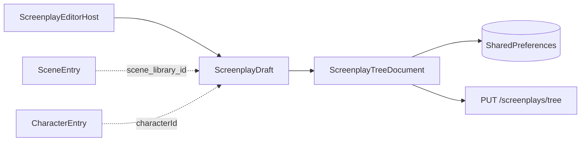

# Script 概念树与现有实现对齐说明

> 关联：[`SCREENPLAY_FLOW.md`](SCREENPLAY_FLOW.md) · [`SCREENPLAY_TREE_UNIFIED.md`](SCREENPLAY_TREE_UNIFIED.md) · [`SCREENPLAY_EXPORT.md`](SCREENPLAY_EXPORT.md)

---

## 1. 概念层级（与代码一致）

应用中的 **Script = Screenplay（剧本）**，采用四层业务树，而非扁平能力清单：

```
Script (Screenplay)
├── Meta                    title, synopsis, tags, cover
├── Defaults (ShootParams)  device, aspect_ratio, lighting
├── LinkedAssets
│   ├── linked_characters[] 角色库引用（CharacterEntry）
│   └── linked_scenes[]      场景库引用（SceneEntry）
├── Acts[] (幕)
│   └── Scenes[] (场)        ← 剧本「场」，非场景库条目
│       └── Frames[] (画/分镜)
│           ├── CineParams           景别 / 机位 / 运镜 / 焦段 / 构图 / duration_sec
│           ├── ShootOverride        设备 / 画幅 / 打光（继承链覆盖）
│           ├── Prompts              positive_prompt / negative_prompt
│           ├── CharacterRef         acgn_character_id + character_name
│           ├── AssetRefs            image + reference_local_paths[]
│           └── pose_id (optional)   Roadmap：角色姿势引用
├── TimelineView (派生)      由各 Frame.durationSec 汇总，无独立 Timeline 实体
└── Export                   .rc0.json（见 SCREENPLAY_EXPORT.md）
```

### 1.1 两种「场景」勿混淆

| 名称 | 代码类型 | 含义 |
|------|----------|------|
| **剧本场** | `SceneDraft` / `ScriptScene` | 幕下的叙事场次：地点、时间、天气、分镜列表 |
| **场景库** | `SceneEntry` | 可复用取景地资产；通过 `scene_library_id` 绑定到剧本场 |

### 1.2 Story（故事）

无独立 `Story` 实体。叙事内容分布在：

- `ScreenplayDraft.synopsis`（剧本简介）
- `ActDraft.synopsis`（幕摘要）
- `SceneDraft.description`（场描述）
- `FrameDraft.caption` / `actionNote`（镜号文案与动作说明）

UI 中的 **Storyboard（故事版）** 是分镜网格视图，不是故事数据模型。

---

## 2. 能力对照表

| 概念 | 状态 | 实现位置 |
|------|------|----------|
| Scene（剧本场） | ✅ | `SceneDraft`, `ScriptScene` |
| Scene（场景库） | ✅ | `SceneEntry`, `scene_library_id` |
| Story | ⚪ 合并到 Screenplay 元信息 | 无独立类型 |
| Character | ✅ 引用式 | `ScreenplayCharacterLink`, `acgn_character_id` |
| Camera | ✅ 帧级扁平 | `CineParams` |
| Lighting | ✅ 继承链 | `ShootParams.lighting` |
| Timeline | ⚪ UI 派生 | `ScriptEditorTimelineTab` |
| Pose Nodes | ❌ Roadmap | `FrameDraft.poseId` 预留字段 |
| Camera Nodes | ❌ Roadmap | 运镜仅为 `CineParams.movement` 单值 |
| Prompt | ✅ | `FrameDraft.positivePrompt` |
| Negative Prompt | ✅ | `FrameDraft.negativePrompt` |
| Render Preset | ⚪ 命名注意 | 见 §3 |
| Export | ✅ JSON | `ScreenplayBundleService` |
| Asset Reference | ✅ 部分 | 主图 + `reference_local_paths` |

图例：✅ 已实现 · ⚪ 部分/语义偏差 · ❌ 未实现（Roadmap）

---

## 3. 摄影预设 vs AI 渲染

| 用户概念 | 代码 | UI 文案 |
|----------|------|---------|
| **摄影预设** | `ShootPreset` / `ShootParams` | 设备、画幅、打光模板 |
| **AI 渲染**（未来） | 尚无 `RenderPreset` | 帧检查器「AI 生成」Tab：正向/反向 Prompt、参考图 |

勿将 `ShootPreset` 称为「渲染预设」。AI 管线参数（model / steps / sampler）尚未建模。

---

## 4. Roadmap（未实现能力）

### 4.1 Pose Nodes

- 目标：帧级绑定角色姿势库条目
- 最小方案：`FrameDraft.poseId` → `extra_params.pose_id`
- 不含姿势节点图编辑器

### 4.2 Camera Nodes

- 目标：运镜关键帧序列
- 最小方案：`extra_params.movement_keyframes[]`（时间 + movement 值）
- 当前仅 `CineParams.movement` 单字段

### 4.3 扩展导出

- 镜头表 Markdown、图片 zip、PDF、视频渲染导出 — 见 [`SCREENPLAY_EXPORT.md`](SCREENPLAY_EXPORT.md)

---

## 5. 数据流



编辑在 `ScreenplayDraft`，持久化为 `tree` JSON，展示层使用 `Screenplay` 读模型（字段较薄，完整元数据在 tree 往返中保留）。
