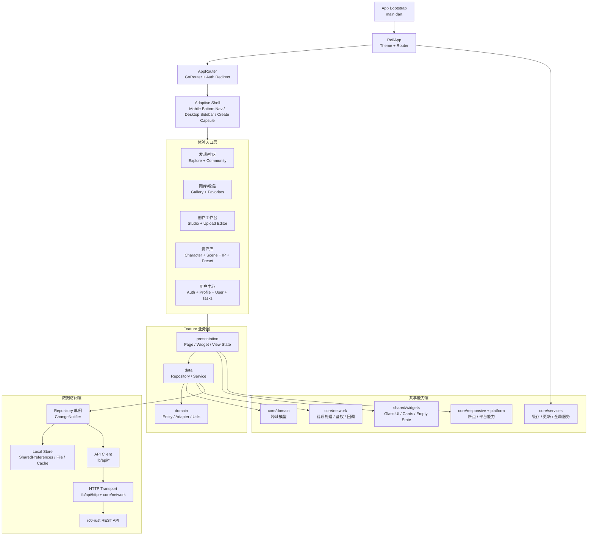
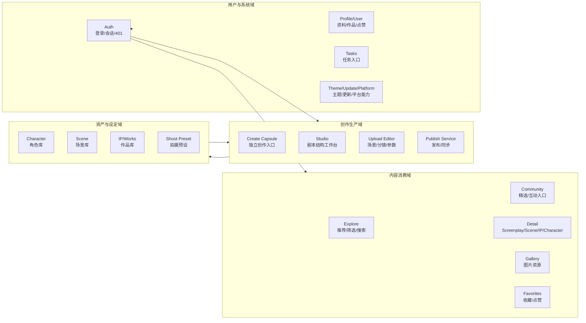
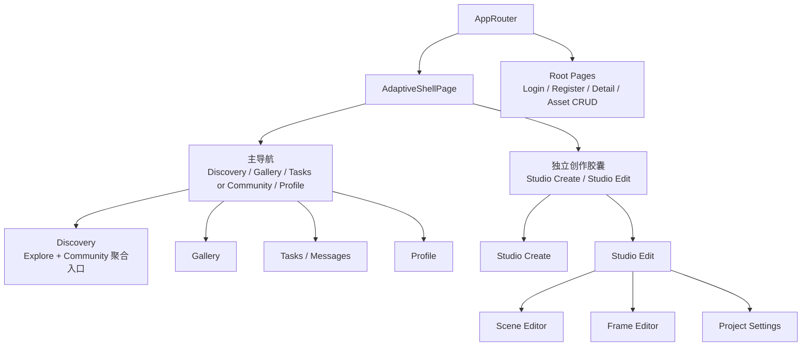
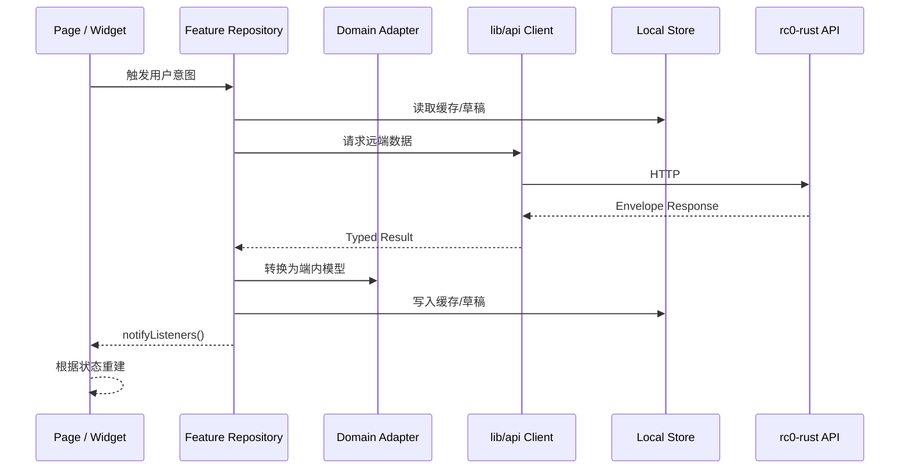
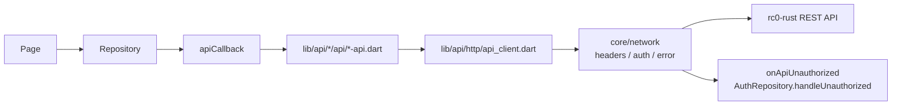

# rc0 App 架构优化版

> Legacy：本文件记录旧的渐进式 Flutter 架构方案。全栈重构请以 `docs/refactor/PRD.md` 与 `docs/refactor/TECHNICAL_DESIGN.md` 为准；文档状态见 `docs/README.md`。

> 面向当前 Flutter 客户端的目标架构说明。本文基于现有 `lib/app/`、`lib/core/`、`lib/features/`、`lib/shared/`、`lib/api/` 结构，不要求一次性重构，而是给出更清晰的职责边界和可渐进落地的演进方向。

## 1) 架构目标

- **功能域清晰**：消费、创作、资产、用户、系统能力分别收敛在对应 feature，避免页面之间互相直连。
- **数据流单向**：Page/Widget 只消费状态和触发意图；Repository 负责业务状态、缓存、API 协调与本地持久化。
- **平台差异下沉**：移动、桌面、Web 差异放在 shell、responsive、platform 层处理，业务页面尽量保持一致。
- **API 边界稳定**：UI 不直接拼 HTTP；所有远端调用统一经过 `lib/api/*` 和 `core/network/*`。
- **可渐进演进**：保留当前 `Singleton Repository + ChangeNotifier` 模式，优先通过命名、分层和依赖方向优化复杂度。

## 2) 优化后总览



## 3) 推荐分层与代码边界

| 层级 | 职责 | 代码位置 | 约束 |
|---|---|---|---|
| Bootstrap | 初始化 Flutter、窗口、主题、鉴权、本地库和后台服务 | `lib/main.dart` | 只做启动编排，不放业务逻辑 |
| App Shell | 应用根、主题、路由、平台壳、主导航 | `lib/app/`、`lib/features/shell/` | 负责入口和布局，不持有业务细节 |
| Feature Presentation | 页面、组件、交互状态、响应式适配 | `lib/features/*/presentation/` | 可依赖本 feature repository 和 shared/core UI |
| Feature Data | Repository、业务服务、远端/本地协调 | `lib/features/*/data/` | UI 不越过 Repository 访问 API |
| Feature Domain | feature 内实体、转换器、纯函数 | `lib/features/*/domain/` | 不依赖 Flutter Widget 和 HTTP |
| Core Domain | 跨 feature 共享模型和规则 | `lib/core/domain/` | 仅放确实跨域复用的模型 |
| Shared UI | 通用视觉组件和无业务 UI | `lib/shared/widgets/` | 不依赖具体 feature repository |
| API Client | 手写后端客户端和传输层 | `lib/api/`、`lib/core/network/` | API 只表达后端契约，不承载页面状态 |

## 4) 功能域优化



### 内容消费域

- `explore` 和 `community` 作为发现入口，统一从 Feed、Community、Screenplay 等 Repository 读取聚合数据。
- 详情页只负责展示和局部操作，点赞、收藏、关注等副作用交给对应 Repository。
- `gallery` 与 `favorites` 共享图片收藏能力时，通过 `core/services/image_favorite_store.dart` 或明确的 repository 接口解耦。

### 创作生产域

- `studio` 负责剧本结构、工作台和编辑入口；`upload` 负责帧、场景、参数和生成流程。
- `screenplay/data` 作为剧本聚合根，承载本地草稿、远端同步、发布、图片本地化等服务。
- 发布链路统一经 `ScreenplayPublishService`，页面不直接组合多个 API 调用。

### 资产与设定域

- `character`、`scene`、`ip`、`shoot_preset` 保持独立 Repository。
- 与创作链路的关联通过 ID、轻量 DTO 或 domain adapter 传递，避免资产页面和编辑器页面互相依赖。
- 角色/场景/IP 的图片关联、使用计数等副作用收敛在各自 Repository 或 domain service。

### 用户与系统域

- `auth` 是会话唯一来源，路由层只处理明确需要登录的页面跳转。
- 需要登录但不适合路由拦截的行为，如发布、上传、点赞、关注，在页面级触发时由 Repository 返回可展示错误。
- 主题、更新、平台能力放在 `core/theme`、`core/services`、`core/platform`，业务 feature 只消费结果。

## 5) 导航结构



导航优化原则：

- 路径常量统一来自 `AppRoutes`，页面跳转使用 `context.push(AppRoutes.xxx)`。
- Tab 内页面走 shell branch；沉浸式编辑、详情、登录注册、资产 CRUD 走 root route。
- 旧路径通过 redirect 收敛到新路径，避免多个入口指向同一业务语义。
- 创作入口保持独立胶囊，不并入主 Tab，降低消费与创作心智冲突。

## 6) 数据流与状态管理



状态管理建议：

- 短期继续使用 `Singleton Repository + ChangeNotifier`，避免为了架构升级引入大规模迁移风险。
- 每个 Repository 明确暴露 `isLoading`、`error`、`items/detail/draft` 等只读状态，写操作通过方法表达意图。
- 页面监听统一使用 `addListener` / `removeListener` 和 `scheduleSetState(this)`，避免异步回调后访问已释放页面。
- 跨 feature 共享状态优先抽到 `core/services` 或 `core/domain` 的接口，不让两个 feature 直接互相持有页面级对象。

## 7) API 与错误处理



约定：

- UI 和 Repository 不手写 URL、不解析响应信封，统一使用 API Client。
- 业务错误用 `apiErrorMessage()` 或 `friendlyNetworkError()` 转换后展示。
- 401 统一交给 `onApiUnauthorized` 和 `AuthRepository.handleUnauthorized`。
- 新增接口前先更新或核对 `docs/APP_API_MATRIX.md`，再补 Repository 封装。

## 8) 推荐目录模板

```text
lib/features/{feature}/
  data/
    {feature}_repository.dart
    {feature}_service.dart
  domain/
    {feature}_entity.dart
    {feature}_adapter.dart
  presentation/
    pages/
      {feature}_page.dart
    widgets/
      {feature}_card.dart
```

适用规则：

- feature 内私有模型放 `features/{feature}/domain/`。
- 多个 feature 共享的模型放 `core/domain/`。
- 跨 feature 复用的 UI 放 `shared/widgets/`。
- API DTO 保持在 `lib/api/*` 或 repository 内部转换，不直接泄漏到页面。

## 9) 演进路线

### 第一阶段：边界收敛

- 梳理页面直接调用 Repository/API 的路径，确保链路统一为 `Page -> Repository -> API`。
- 为核心 Repository 补齐只读状态字段和一致的加载/错误表达。
- 将跨 feature 的纯模型、adapter、工具函数移动到 `core/domain` 或 `core/utils`。

### 第二阶段：创作链路稳定

- 明确 `studio` 与 `upload` 的职责分界：结构编辑归 Studio，帧/参数/生成归 Upload。
- 将发布、同步、图片本地化、草稿保存作为 `screenplay/data` 的稳定服务能力。
- 统一草稿、本地文件、远端树之间的转换入口，减少页面内转换代码。

### 第三阶段：体验与平台能力沉淀

- 把移动/桌面差异继续收敛到 `AdaptiveShellPage`、responsive builder 和 platform features。
- 将 Glass UI、导航组件、空态、卡片等沉淀到 `shared/widgets`，保持业务页面轻量。
- 为 Auth、Feed、Screenplay、Gallery、Asset 等关键 Repository 增加聚焦测试。

## 10) 架构红线

- 页面不直接访问 `lib/api/http`。
- 业务 feature 不依赖另一个 feature 的 presentation 层。
- `shared/widgets` 不依赖具体业务 Repository。
- `core/domain` 不依赖 Flutter Widget 和网络实现。
- 新业务不要绕过 `AppRoutes` 注册临时路径。
- 新增本地持久化必须明确归属 Repository 或 core service，避免散落在页面里。
