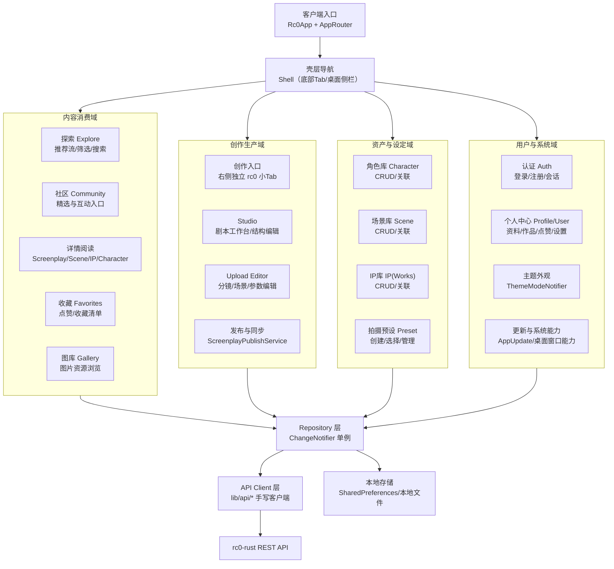
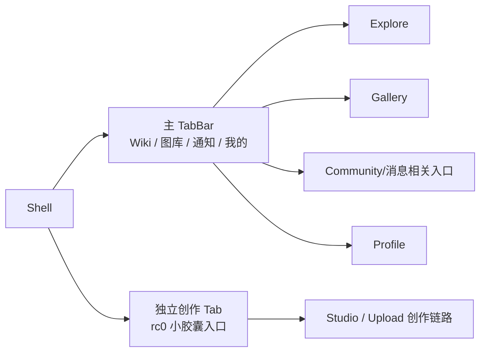

# rc0 产品功能架构图（当前）

> Legacy：本文件记录旧产品功能架构。全栈重构请以 `docs/refactor/PRD.md` 与 `docs/refactor/TECHNICAL_DESIGN.md` 为准；文档状态见 `docs/README.md`。

> 面向当前 Flutter 客户端（`lib/features/*`）的功能架构梳理。

## 1) 功能架构总览

## 2) 端内核心导航结构

## 3) 功能分层（代码映射）

| 层级 | 主要模块 | 代码位置 |
|---|---|---|
| 应用壳 | 路由、主题、平台壳 | `lib/app/` |
| 核心能力 | domain/network/responsive/theme/utils | `lib/core/` |
| 功能域 | `auth` `explore` `community` `favorites` `gallery` `screenplay` `studio` `upload` `character` `scene` `ip` `profile` `user` `shell` | `lib/features/` |
| 共享UI | 玻璃组件、导航组件、通用卡片/空态 | `lib/shared/widgets/` |
| API访问 | 各业务 API 客户端 + HTTP 传输层 | `lib/api/` |

## 4) 关键业务链路

1. **消费链路**：Explore/Community/Favorites/Gallery → Repository → API(`screenplays/feed/images/...`)  
2. **创作链路**：rc0 创作入口 → Studio/Upload Editor → Draft/Repository → 发布同步  
3. **资产链路**：Character/Scene/IP/Preset 管理 → 关联到分镜与图片  
4. **用户链路**：Auth → Profile/User 页 → 外观/版本/资料等设置  

## 5) 当前架构特征

- 采用 **Feature-first** 组织，页面与数据按业务拆分；
- 状态管理以 **Singleton Repository + ChangeNotifier** 为主；
- API 调用统一经 `lib/api/*/api/*-api.dart`，避免 UI 直连 HTTP；
- 移动端以 Shell 浮动导航为中心，创作入口从主 Tab 分离为独立胶囊按钮；
- 支持多端（移动/桌面/Web）自适应布局。

