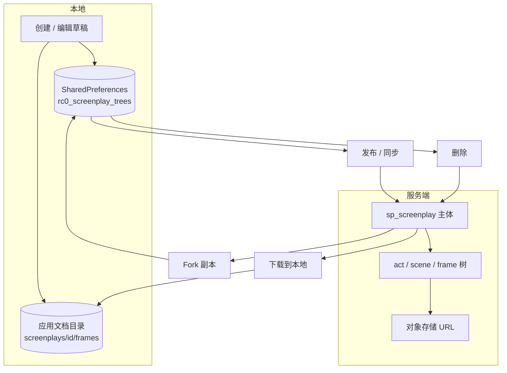
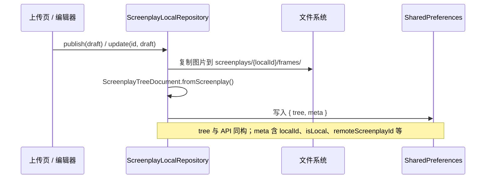
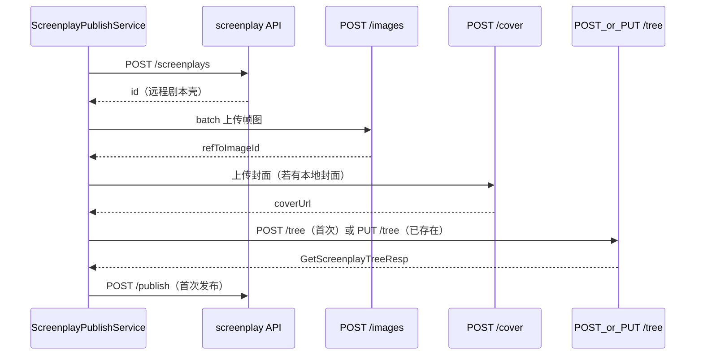
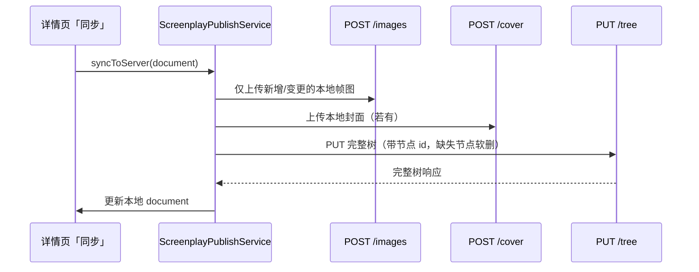
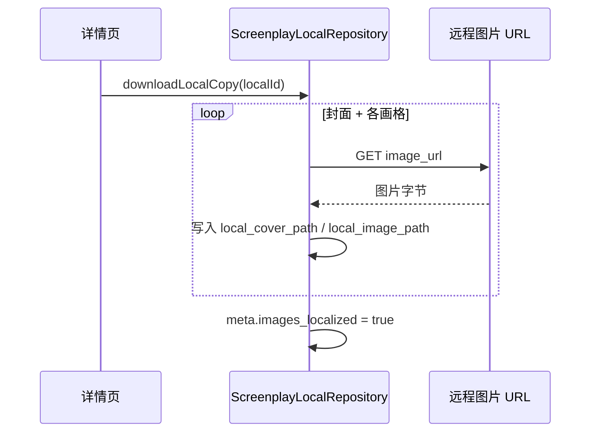
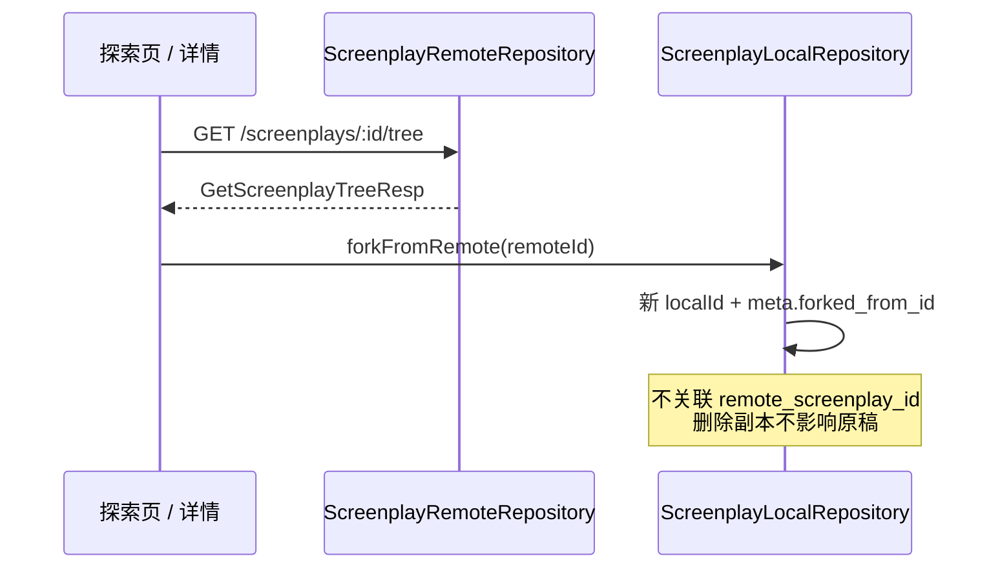
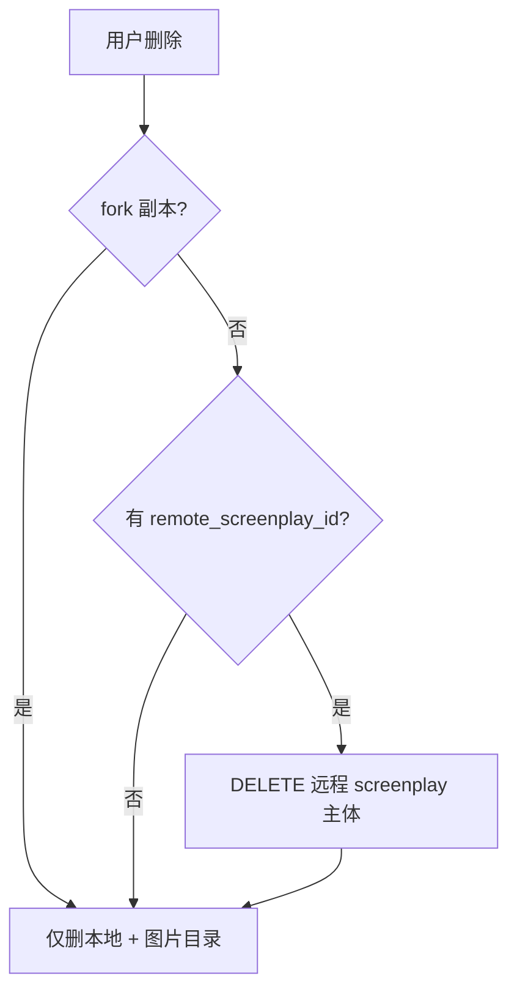
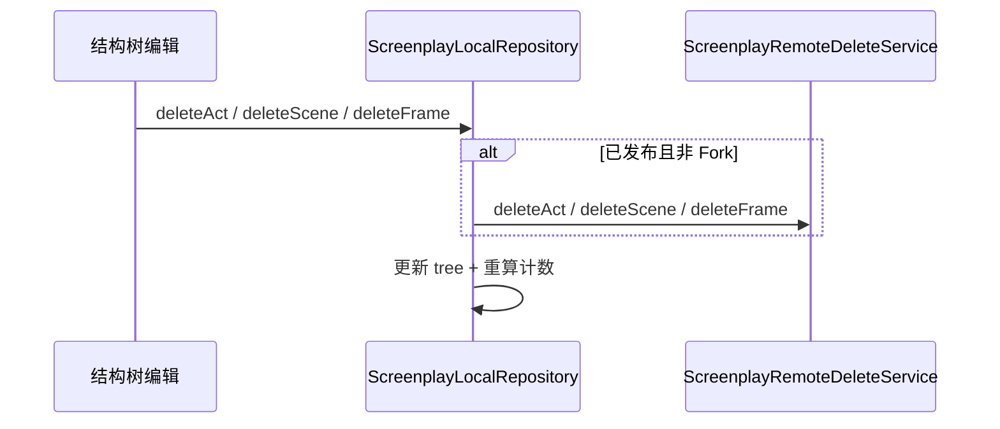

# 剧本全流程说明

> Legacy-reference：本文件记录旧剧本流程说明。全栈重构的数据模型与媒体资产方案请以 `docs/refactor/TECHNICAL_DESIGN.md` 为准；文档状态见 `docs/README.md`。

> 概念树对照：[`SCRIPT_CONCEPT_TREE.md`](SCRIPT_CONCEPT_TREE.md) · 导出范围：[`SCREENPLAY_EXPORT.md`](SCREENPLAY_EXPORT.md)  
> 对照联调文件：[`lib/api/http/screenplay/screenplay.http`](../lib/api/http/screenplay/screenplay.http)  
> 树接口细节：[`SCREENPLAY_TREE_API.md`](SCREENPLAY_TREE_API.md)  
> App 实现：`lib/features/screenplay/data/`

---

## 1. 总览



| 操作 | 仅本地 | 触及服务端 |
|------|--------|------------|
| 创建草稿 | ✅ | — |
| 编辑幕/场/镜 | ✅ | 已发布时删除节点会同步 |
| 首次发布 | ✅ | ✅ |
| 同步修改 | ✅ | ✅ |
| Fork 远程剧本 | ✅ 新副本 | 读树 |
| 下载图片 | ✅ | 读 CDN |
| 删除整本 | ✅ | 非 Fork 时删远程主体 |
| 删除幕/场/镜 | ✅ | 已发布且非 Fork 时同步 |

---

## 2. 本地创建与存储



**本地 JSON 形状**（`ScreenplayTreeDocument`）：

```json
{
  "tree": {
    "screenplay": {
      "title": "标题",
      "local_cover_path": "/data/.../cover.jpg",
      "cover_url": ""
    },
    "acts": [
      {
        "act": { "title": "第一幕", "sort": 1 },
        "scenes": [
          {
            "scene": { "title": "第一场", "sort": 1 },
            "frames": [
              {
                "local_image_path": "/data/.../frame-0.jpg",
                "dialogue": "台词"
              }
            ]
          }
        ]
      }
    ]
  },
  "meta": {
    "local_id": "script-1710000000000",
    "is_local": true,
    "remote_screenplay_id": null,
    "images_localized": false
  }
}
```

**关键模块**

| 模块 | 职责 |
|------|------|
| `ScreenplayLocalRepository.publish` | 从 `ScreenplayDraft` 创建本地剧本 |
| `ScreenplayLocalRepository.update` | 更新本地剧本内容与图片 |
| `ScreenplayTreeDocument` | `{ tree, meta }` 持久化单元 |

---

## 3. 首次发布（Mode A，对齐 screenplay.http）

与 `screenplay.http` 一致：**先建壳 → 上传资源 → POST/PUT 保存树 → publish**。



**HTTP 对照**（`screenplay.http`）

| 步骤 | HTTP | App 实现 |
|------|------|----------|
| 1 创建壳 | `createScreenplay` | `ScreenplayPublishService._createScreenplay` |
| 2 上传帧图 | `POST /images` | `DataUploadRepository.uploadBatch` |
| 3 上传封面 | `uploadScreenplayCover` | `DataUploadRepository.uploadScreenplayCover` |
| 4 保存树 | `createScreenplayTree` / `updateScreenplayTree` | `ScreenplayRemoteRepository.saveScreenplayTree` |

**POST/PUT 请求体**（与 Rust `SaveScreenplayTreeReq` 同构，无 `tree` 包装层）：

```json
{
  "asset_map": {
    "frame-0-0-0": {
      "kind": "frame_image",
      "remote_url": "",
      "remote_image_id": 101
    }
  },
  "screenplay": {
    "title": "标题",
    "cover_url": "https://cdn/.../cover.jpg"
  },
  "acts": [
    {
      "act": { "id": 0, "title": "第一幕", "sort": 1 },
      "scenes": [
        {
          "scene": { "id": 0, "title": "第一场", "sort": 1 },
          "frames": [
            { "id": 0, "title": "", "sort": 1, "image_ref": "frame-0-0-0" }
          ]
        }
      ]
    }
  ]
}
```

**ref 约定**（`ScreenplayApiMapper`）

| ref | 用途 |
|-----|------|
| `cover-ref` | 封面 |
| `frame-{act}-{scene}-{frame}` | 画格图 |

---

## 4. 同步修改（已发布剧本）



- 已发布剧本 `meta.remote_screenplay_id` 非空时，详情页操作走 **同步** 而非首次发布。
- `buildSaveTreePayload(isRepublish: true)` 会保留 act/scene/frame 的远程 `id`。
- 同步时 `screenplay` 可携带 `publish_status`、`visibility`、`published_at` 更新元数据。

---

## 5. 下载到本地



**适用场景**

- Fork 远程剧本后的副本（`forkFromRemote` → 可选 `downloadImages: true`）
- 用户主动「下载图片到本地」

**模块**：`ScreenplayLocalRepository.downloadLocalCopy`

---

## 6. Fork（从远程生成本地副本）



---

## 7. 删除

### 7.1 删除整本剧本



| API | 说明 |
|-----|------|
| `deleteScreenplay` (POST) | 删除 `sp_screenplay` 主体（生成客户端） |
| 本地 | 移除 SharedPreferences 条目 + `screenplays/{localId}/` 目录 |

**模块**：`ScreenplayLocalRepository.deleteScreenplay` → `ScreenplayRemoteDeleteService`

### 7.2 删除幕 / 场 / 画格



| 操作 | 远程 API |
|------|----------|
| 删幕 | `DELETE .../acts/:actId` |
| 删场 | `DELETE .../acts/:actId/scenes/:sceneId` |
| 删画格 | `DELETE .../acts/.../frames/:frameId` |

### 7.3 清空树（保留主体）

`screenplay.http` → `deleteScreenplayTree`：`DELETE /screenplays/:id/tree`  
软删除全部 act/scene/frame，**不删** screenplay 主体。  
App 层封装：`screenplay_tree_http.deleteScreenplayTreeDelete`（当前 UI 未接）。

---

## 8. 模式 B（multipart 一步保存）

`screenplay.http` → `saveScreenplayTreeMultipart`：单次 PUT multipart，part `tree` + `files` + `refs`。  
App **未默认使用**；大文件或简化客户端时可接 `screenplay_tree_http` 扩展。

---

## 9. 模块索引

| 场景 | 文件 |
|------|------|
| 本地 CRUD | `screenplay_local_repository.dart` |
| 发布 / 同步 | `screenplay_publish_service.dart` |
| 远程读列表 / 读树 | `screenplay_remote_repository.dart` |
| 远程删节点 | `screenplay_remote_delete_service.dart` |
| 树 PUT/GET/DELETE | `screenplay_tree_http.dart` |
| 剧本域上传 | `tree_assets_upload.dart` |
| 通用批量上传 | `batch_upload.dart` |
| 请求体构建 | `screenplay_api_mapper.dart` |
| UI 发布入口 | `screenplay_detail_page.dart` |

---

## 10. 联调检查清单

1. 登录获取 token（`screenplay.http` → `login`）
2. 本地创建带封面/画格的剧本
3. 发布 → 日志应依次出现：
   - `POST /api/screenplay/screenplays`
   - `POST /api/screenplay/screenplays/{id}/tree/assets`
   - `PUT /api/screenplay/screenplays/{id}/tree`
4. `GET .../tree?depth=3` 验证结构
5. 本地修改后点「同步」→ 仅 PUT tree（有新媒体时先 tree/assets）
6. Fork → 下载图片 → 确认 `images_localized`
7. 删除 → 远程列表不再出现（非 Fork 原件）
