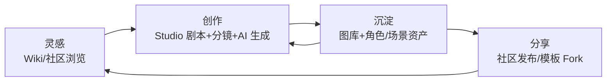

# rc0 产品创意设计规范（Product Concept）

> 版本：v1.0 · 定位来源：[../refactor/PRD.md](../refactor/PRD.md)
> 视觉/交互承接：[UI_STYLE_GUIDE.md](UI_STYLE_GUIDE.md) · [UX_GUIDELINES.md](UX_GUIDELINES.md)

---

## 1. 产品创意核心

### 1.1 一句话定位

**rc0 是面向摄影师、导演、设计师的视觉创作操作系统** —— 把"脑中的画面"变成"可执行的分镜"，再变成"可分享的作品"。

### 1.2 核心创意：剧本是空间，画面是居民

传统工具把剧本当文档、把图片当附件。rc0 的创意反转了这个关系：

- **剧本（Screenplay）是一个可漫游的空间结构**：`Act → Scene → Frame` 是空间的层级，不是文档的章节。
- **每个 Frame 是一格"取景窗"**：动作、打光、镜头参数、AI 生成图都落在这格取景窗里。
- **资产是可复用的"演员与布景"**：角色 Wiki、场景 Wiki、拍摄预设像片场资源一样被调度进任何取景窗。

这就是 Liquid Glass 风格与产品的深层契合点：**内容即世界（剧照/分镜占据空间主体），UI 是导演手中透明的取景框**。

### 1.3 三个创作飞轮

- **消费 → 创作**：任何看到的剧本可 Fork 为模板起点；任何图片可追溯拍法（预设/参数）。
- **创作 → 沉淀**：生成图自动入库并关联来源；角色/场景一次创建、多剧本复用。
- **沉淀 → 分享**：作品发布进社区 Feed，优秀模板进入精选，形成他人灵感。

---

## 2. 用户与创作心智

### 2.1 三类创作者的差异化体验

| 角色 | 核心诉求 | rc0 给予的"超能力" |
|---|---|---|
| 导演/分镜师 | 快速把叙事拆成可拍的镜头 | 树状剧本 + Frame 级 AI 预览，"先看到再开拍" |
| 摄影师 | 视觉一致性与技法沉淀 | 打光/镜头/机位预设库，参数可复用可分享 |
| 设计师/概念创作者 | 高产出的视觉资产管理 | 角色/场景 Wiki + 生成图自动归档溯源 |

### 2.2 创作心智模式（决定界面形态）

- **浏览心智**（放松、被启发）→ 大图 Feed、沉浸详情、玻璃浮层轻操作。
- **构建心智**（专注、有目标）→ Studio 全屏编辑，工具浮现/消融，零干扰。
- **调度心智**（挑选、组合）→ Picker Sheet 快速调用资产，不离开上下文。

产品的每个页面必须明确服务其中一种心智，混合心智的页面（既浏览又编辑）是设计缺陷。

---

## 3. 关键创意机制规范

### 3.1 Frame = 最小创作单元

- 所有能力（动作/打光/摄影/AI 生成）最终落点是 Frame（或 Scene 级默认值）。
- 新增任何 AI/参数能力时，优先接入 Frame 编辑器，禁止另建孤立的生成页。
- Frame 的画面预览永远是视觉主体；参数是浮动工具层。

### 3.2 预设（Preset）= 可流通的拍摄技法

- 预设封装动作/打光/摄影参数组合，命名面向拍摄语言（"伦勃朗光·35mm·仰拍"），不是参数罗列。
- 预设可从任何成品 Frame "提取"，可应用到任何 Frame，可发布分享——技法本身成为内容。

### 3.3 AI 生成 = 片场的即时打样

- 生成的产品语义是"打样（Proof）"：帮创作者验证脑中画面，而非替代创作。
- Prompt 由结构化参数（角色+场景+动作+光+镜头）自动合成（`ai_prompt_builder` 模式），用户微调而非从零手写。
- 每张生成图保留完整"拍摄档案"（prompt/model/seed/参数），可复现、可变体、可提取为预设。

### 3.4 Fork = 剧本的翻拍权

- 模板 Fork 是完整树复制（单事务），Fork 后与原作保持"翻拍自"血缘展示。
- 鼓励"同一剧本，不同拍法"的社区玩法：同源剧本可对比不同创作者的分镜诠释。

---

## 4. 内容生态与社区调性

- **调性**：专业创作社区，不是图片瀑布流站。Feed 排序偏向"有结构的作品"（完整剧本 > 单图）。
- **激励**：点赞/收藏之外，"被 Fork 数"与"预设被使用数"是核心创作者声誉指标。
- **品质门槛**：发布需封面 + 简介；精选合集（`sp_featured_collection`）人工策展保持社区水位。
- **可见性分级**：私密草稿 → 公开作品 → 模板（可 Fork）→ 精选，创作者自主控制开放程度。

---

## 5. 差异化护城河（设计时刻守住）

1. **结构化创作数据**：竞品沉淀的是图，rc0 沉淀的是"剧本树 + 拍摄参数 + 资产关系"——这是不可迁移的创作资产。
2. **技法可流通**：预设与参数档案让"怎么拍出来的"成为可分享、可复用的一等公民。
3. **端到端追溯**：从灵感到成图全链路可回放，服务创作复盘与团队协作。
4. **空间化体验**：Liquid Glass 的内容主导美学与"剧本即空间"的产品隐喻互为表里，形成统一的品牌感知。

---

## 6. 创意扩展方向（插件化承载）

以下方向经 `FeatureModule` 插件机制扩展，不改内核（见 [../refactor/TECHNICAL_DESIGN.md](../refactor/TECHNICAL_DESIGN.md)）：

| 方向 | 形态 | 依赖 |
|---|---|---|
| 3D 预演 | Frame 内 Unity 场景摆位/打光预览 | 现有 `runtime_3d` 三层桥 |
| 视频分镜 | Frame 序列导出动态样片 | 生成管线扩展 |
| 团队协作 | 剧本共享工作区 + 评论批注 | 策略级权限（PRD 待决策项） |
| 实拍勘景 | 场景 Wiki 地理信息 + 地图找景 | 现有 `flutter_map` + geo 字段 |
| 设备联动 | 摄影参数同步真实机身/灯具 | `cine_equipment` 数据模型 |

扩展准入标准：新能力必须回答"落在哪个 Frame/资产上？如何回溯？"——不能回答的功能不做。

---

## 7. 品牌表达一致性

- 名称语义：rc0 = "Take Zero / 第 0 条"，开拍前的第一次预演——所有文案围绕"预演、打样、开拍"的片场语言。
- 视觉人格：专业冷静（中性玻璃 UI）+ 创作热情（内容自身的色彩）；紫色 accent 仅作行动召唤，不抢内容。
- 空态/引导文案用片场口吻（"这个场景还没有分镜，开拍第一格？"），保持角色一致。
