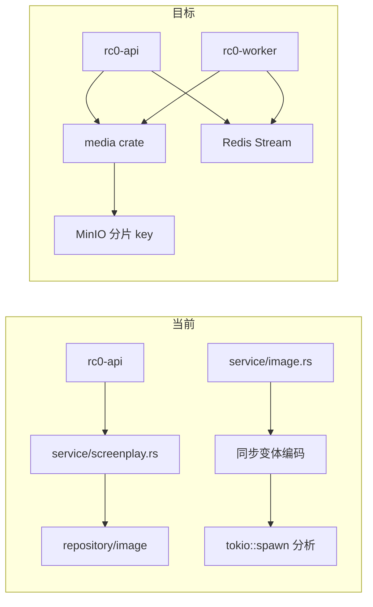

# rc0 后端启动审阅（Kickoff）

> 审阅日期：2026-07-07 · 仓库：`C:/Users/qianlNya/RustroverProjects/rc0-rust`

## 审阅范围

| 文件 | 结论 |
|---|---|
| `src/service/screenplay.rs` | God module（~838 行）：剧本 CRUD、树解析、engagement、图片 presign/下载、封面上传与 `repository/image` 直连 |
| `src/service/image.rs` | 请求内同步 `generate_variants`（display/feed/thumb WebP），去重按 display checksum；分析通过 `jobs/image_analysis::spawn` 进程内 `tokio::spawn` |
| `src/jobs/image_analysis.rs` | 无队列；失败仅 tracing error；与 API 请求生命周期解耦不足 |
| `docs/openapi.yaml` | REST 契约 SSOT（前端 `06-api-contracts` 应对齐此文件） |

## 与目标架构差距

## 建议落地顺序（后端）

1. **Cargo workspace 骨架**：`crates/infra`、`crates/media`、`crates/screenplay`；`bin/api.rs` + `bin/worker.rs` 复用 crate。
2. **拆 `service/screenplay.rs`**：`ScreenplayService`（CRUD/engagement）+ `ScreenplayTreeService`（tree save/resolve）；图片 presign/下载迁到 `MediaService`。
3. **异步上传管线**：`POST /images` 仅落原图 + `processing` 状态 + 入队；worker 生成变体并回写 `acgn_image_file`。
4. **规模化**：MinIO key `{ab}/{cd}/{md5}.ext`、引用计数 GC、`acgn_image*` 时间分区、list N+1 批量加载。
5. **分层补齐**：character/scene/community handler 不再直连 repository。

## 前端协同窗口

- `ImageRef` 规范化需与 media presign 统一：前端只持久化 `imageId`/`fileId`，展示 URL 由服务端签发。
- 兼容期：后端继续回填 `image_url`/`thumbnail_url`，前端双写后下线冗余字段。

## 风险

| 风险 | 缓解 |
|---|---|
| 存量 MinIO 扁平 key | 双读 + 后台 rekey |
| worker 可靠性 | Redis Stream + 重试 + 死信 |
| 拆分 god module 回归面大 | 按 handler 用例分批迁移 + 契约测试 |

## 下一步（后端阶段 1）

- [ ] 新建 `crates/media` 并迁出 `service/image.rs` 核心逻辑
- [ ] 定义 `media.process` Redis Stream 与 `rc0-worker` 消费者骨架
- [ ] `service/screenplay.rs` 中图片相关函数改为调用 `MediaService` facade（行为不变）
