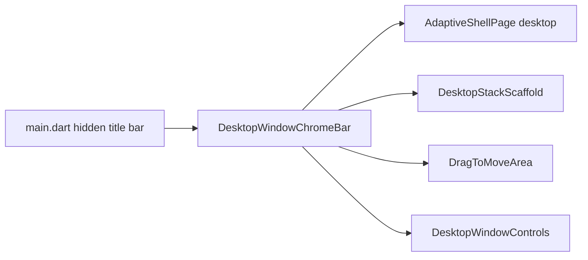

# 桌面窗口栏（拖拽 / 缩放 / 红绿灯）· 产品需求文档（PRD）

> 版本：v1.0 · 状态：实施中（2026-07-09 开工）  
> 范围：Windows / macOS / Linux 无边框窗口的拖拽区、最小化 / 最大化·还原 / 全屏、macOS 红绿灯  
> 关联：[UI_STYLE_GUIDE.md](../design/UI_STYLE_GUIDE.md) §9 · [UX_GUIDELINES.md](../design/UX_GUIDELINES.md) · [SHELL_NAV_PRD.md](SHELL_NAV_PRD.md)  
> 实现锚点：`window_manager` · `desktop_title_bar.dart` · `DesktopSidebar` · `AdaptiveShellPage` · `main.dart`

---

## 1. 背景与问题

### 1.1 产品上下文

rc0 桌面端使用 `window_manager` 隐藏系统标题栏（`TitleBarStyle.hidden` + `windowButtonVisibility: false`），意图用自定义 Liquid Glass 壳替代原生顶栏。  
Shell 导航已按 [SHELL_NAV_PRD](SHELL_NAV_PRD.md) 收敛为「侧栏 L1 + 创作 CTA」；窗口栏必须与之配套，否则无边框窗口在 Windows 上几乎无法拖动与关闭。

### 1.2 现状（代码级）

| 能力 | macOS | Windows | Linux |
|---|---|---|---|
| 隐藏原生标题栏 | ✅ `main.dart` | ✅ | ✅ |
| 自定义关闭/最小化/最大化 | ✅ 侧栏顶部红绿灯（自绘） | ❌ 控件已实现但未挂载 | ❌ 同左 |
| 拖拽移动窗口 | ❌ 无 live `DragToMoveArea` | ❌ | ❌ |
| 双击顶栏最大化 | ❌ | ❌ | ❌ |
| 全屏（Fullscreen） | ❌ 仅 maximize | ❌ | ❌ |
| Token 对齐 | 颜色用了 `macWindow*`；高度/左边距未用 token | — | — |

关键事实：

- `DesktopWindowControls` 已分平台实现（mac 左红绿灯 / Win·Linux 右图标）。
- `DesktopMergedTitleBar` / `DesktopMinimalTitleBar`（含 `DragToMoveArea`）为**死代码**，零引用。
- 仅 `DesktopSidebar` 在 macOS 挂载了控件行（高 `kDesktopTitleBarHeight = 52`）。
- 规范写「标题栏高 40、mac 左预留 72」（`AppDimensions`），代码未遵守。

### 1.3 核心痛点

| 编号 | 痛点 |
|---|---|
| W1 | **Windows/Linux 无边框后无控件、无拖拽**，用户无法正常移动/关闭窗口 |
| W2 | **拖拽区未接入 live UI**，mac 也只能点按钮，不能拖侧栏空白移动窗口 |
| W3 | **高度与 inset 双轨**：52 vs 40、硬编码 padding vs `macTitleBarLeadingInset=72` |
| W4 | **绿灯语义不清**：当前是 maximize，mac 用户期望 zoom / 可选全屏 |
| W5 | **栈路由页（设置/详情）无窗口栏**，离开 shell 后 Win 端更难操作 |
| W6 | 死代码与 live 路径分裂，后续改动易漏挂载 |

### 1.4 目标

- **G1** 三端均可：拖动窗口、最小化、最大化/还原、关闭。
- **G2** macOS 红绿灯位置、间距、hover 符合系统心智；左侧内容避让 `macTitleBarLeadingInset`。
- **G3** Windows/Linux 右侧标准三键；关闭键 hover 用危险色。
- **G4** 明确「最大化」与「全屏」；提供可发现的全屏入口（快捷键 + 可选菜单/长按）。
- **G5** 单一窗口栏组件接入 Shell 与栈页；删除或收口死代码；token 单一真相源。

### 1.5 非目标

- 不引入 `bitsdojo_window` / `flutter_acrylic`（本期继续 `window_manager`）。
- 不做自定义窗口圆角/亚克力模糊系统级效果。
- 不改移动端 SystemChrome。
- 不把窗口栏做成第二套业务导航（不放 Tab）。

---

## 2. 用户故事

1. **作为 Windows 用户**，我可以拖动窗口任意空白顶区移动应用，并用右上角按钮最小化 / 最大化 / 关闭。
2. **作为 macOS 用户**，我在侧栏左上看到红黄绿，行为接近系统；拖侧栏顶区可移动窗口；内容不被红绿灯挡住。
3. **作为 Linux 用户**，体验与 Windows 对齐（右上三键 + 顶区拖拽）。
4. **作为创作者**，我可用快捷键进入/退出全屏沉浸看模板或 Studio，且知道如何退出。
5. **作为在设置/详情页的用户**，离开主 Shell 后仍能拖动与关闭窗口。

---

## 3. 信息架构与布局

### 3.1 统一窗口栏模型

```
┌──────────────────────────────────────────────────────────┐
│ [mac 红绿灯]  ←── Drag Region ──→  [Win/Linux 三键]      │  ← WindowChromeBar
│                                                          │
│  Sidebar (L1…)              │  Content                   │
└──────────────────────────────────────────────────────────┘
```

| 区域 | macOS | Windows / Linux |
|---|---|---|
| 窗口控件 | **左**，红绿灯 | **右**，─ □ ✕ |
| 拖拽区 | 顶栏剩余宽度（不含按钮命中区） | 同左 |
| 高度 | 统一 `AppDimensions.titleBarHeight`（目标 **40**） | 同左 |
| 左侧内容避让 | ≥ `macTitleBarLeadingInset`（**72**） | 0 |

**决策（本期默认）：**

- Shell 桌面布局：窗口栏与侧栏顶对齐——mac 红绿灯仍落在侧栏左上视觉区，但拖拽区横跨「侧栏顶 + 内容顶」整行（或等价：整窗顶一条透明/玻璃拖拽带）。
- 栈路由页：使用同一 `DesktopWindowChromeBar`（极简：拖拽 + 控件），不依赖侧栏是否存在。

### 3.2 与 Shell 导航的关系

- 窗口栏是 **OS 层**，Shell 导航是 **产品层**；二者可同高叠放，但命中测试分离：
  - 按钮 / 创作 CTA / L1 行：不触发拖拽。
  - 顶栏空白、Logo 旁空白、内容顶安全区：可拖拽。
- 不在窗口栏放置「模板/场景」等 L1 文案（避免与 SHELL_NAV_PRD 冲突）。

---

## 4. 交互规范

### 4.1 拖拽（Drag）

| 规则 | 说明 |
|---|---|
| 实现 | `DragToMoveArea`（`window_manager`）包裹可拖区域 |
| 排除 | 窗口按钮、可点击导航、输入框、滚动列表主区域 |
| 双击拖拽区 | **切换最大化 / 还原**（三端一致） |
| 最大化后拖拽 | 允许拖出还原（若 `window_manager` 支持；否则至少保持双击还原） |

### 4.2 最小化 / 最大化·还原 / 关闭

| 操作 | macOS | Windows / Linux |
|---|---|---|
| 关闭 | 红灯 → `windowManager.close()` | ✕ → `close()`；hover `AppColors.error` |
| 最小化 | 黄灯 → `minimize()` | ─ → `minimize()` |
| 缩放 | 绿灯 → **maximize / unmaximize**（与现实现一致） | □ / 还原图标 → 同左 |
| 状态同步 | `WindowListener` onMaximize / onUnmaximize | 同左 |

### 4.3 全屏（Fullscreen）

与「最大化」分离：

| 项 | 规范 |
|---|---|
| API | `windowManager.setFullScreen(true/false)` |
| 进入 | 快捷键：mac `⌃⌘F`；Win/Linux `F11`（可再加菜单「视图 → 全屏」下期） |
| 退出 | 同一快捷键；全屏时顶栏可自动隐藏，**移到顶部边缘短暂露出**退出控件（或 Esc，若与业务 Esc 不冲突则允许） |
| 绿灯 | **不**改为系统原生全屏（避免与自定义按钮冲突）；全屏走快捷键，tooltip 写清「最大化」 |
| Studio L4 | 可默认建议全屏，但不强制 |

### 4.4 macOS 红绿灯视觉

| 项 | 规范 |
|---|---|
| 颜色 | `AppColors.macWindowClose / Minimize / Zoom` |
| 尺寸 | 直径 12；间距 8（可收为 token：`macWindowButtonSize` / `macWindowButtonGap`） |
| 左边距 | 视觉对齐系统：容器左 inset 使三灯落在约 72 预留区内 |
| Hover | 略降透明度或显示系统式符号（可选增强；本期至少保持可点与 tooltip） |
| 非 mac | 禁止渲染圆形红绿灯 |

### 4.5 Windows / Linux 三键视觉

| 项 | 规范 |
|---|---|
| 热区宽 | 46（可 token 化） |
| 高 | 等于标题栏高 |
| 图标 | 最小化 / 最大化·还原 / 关闭；尺寸 16 |
| 关闭 hover | 危险底 + 白图标 |

---

## 5. 页面覆盖范围

### 5.1 Must（本期）

| 表面 | 要求 |
|---|---|
| `AdaptiveShellPage` 桌面壳 | 三端可拖；mac 灯 / Win 键可见且可用 |
| 桌面栈页（`DesktopStackScaffold` / 等价根页） | 极简窗口栏：拖拽 + 控件 |
| Token | `titleBarHeight=40`、`macTitleBarLeadingInset=72` 真正被引用；废弃散落 `kDesktopTitleBarHeight=52` 或改为 alias |

### 5.2 Should（下期）

- 全屏边缘唤出条
- 红绿灯 hover 显示 − □ × 符号
- 多显示器 maximize 行为细测
- 标题文案（可选显示当前页名）居中且不抢拖拽

### 5.3 Won't

- 自定义窗口阴影/圆角系统级
- 移动端模拟桌面顶栏

---

## 6. 技术约束

| 约束 | 说明 |
|---|---|
| 依赖 | 继续 `window_manager`；不新增窗口框架包 |
| 门控 | `shouldUseDesktopWindowChrome`（测试环境关闭） |
| 组件 | 收敛为 `DesktopWindowChromeBar`（或复活并修正 `DesktopMinimalTitleBar` / `DesktopMergedTitleBar`）；**一处实现、多处挂载** |
| mac 挂载 | 侧栏左上控件 + 整顶拖拽带；避免只有 52 高空白无拖拽 |
| Win 挂载 | 必须在 Shell 与栈页右侧出现三键 |
| 死代码 | 无引用的重复标题栏删除或改为上述唯一实现的 typedef |
| 文档 | 更新 `UI_STYLE_GUIDE.md` §9 与实现一致 |



---

## 7. 验收标准

| # | 标准 |
|---|---|
| A1 | Windows：无边框下可拖动窗口；右上三键可最小化 / 最大化·还原 / 关闭 |
| A2 | macOS：左上红绿灯可关 / 最小化 / 最大化·还原；内容不被灯挡住（左 inset ≥ 72） |
| A3 | Linux：行为与 Windows 对齐 |
| A4 | 双击顶栏拖拽区可切换最大化 |
| A5 | F11（Win/Linux）或 ⌃⌘F（mac）可切换全屏；能退出 |
| A6 | 设置 / 登录等栈页仍可拖动与关闭 |
| A7 | 按钮命中区不触发拖拽；列表滚动不被拖拽抢走 |
| A8 | 高度与 inset 使用 `AppDimensions` token；无 52/40 双轨 |
| A9 | `flutter test` 下不初始化真实窗口栏（现有 `FLUTTER_TEST` 门控保持） |

---

## 8. 风险与开放问题

| 风险 | 缓解 |
|---|---|
| 拖拽区过大抢走点击 | 明确排除列表；仅顶栏安全区可拖 |
| 全屏与业务 Esc 冲突 | 全屏优先用平台快捷键；Esc 策略在实现时按页声明 |
| 自绘红绿灯 ≠ 原生 | 接受视觉近似；不调用 `windowButtonVisibility: true` 以免双份按钮 |
| 多窗口/多桌面 | 本期单窗口假设 |

**开放问题（评审拍板，PRD 默认已选）：**

1. 绿灯：maximize（默认）还是原生 zoom？→ **maximize**  
2. 全屏：仅快捷键（默认）还是加菜单项？→ **本期仅快捷键**  
3. Shell 顶栏：整窗一条 vs 仅侧栏顶？→ **整窗顶拖拽带 + mac 灯在左 / Win 键在右**

---

## 9. 里程碑

### M1 — 可用性修复（优先）

- [ ] 挂载 Win/Linux 三键到 Shell
- [ ] 全壳顶 `DragToMoveArea`
- [ ] 栈页极简窗口栏
- [ ] 双击最大化

### M2 — 规范对齐

- [ ] token 统一高度/inset
- [ ] 清理死代码
- [ ] 更新 UI_STYLE_GUIDE §9

### M3 — 全屏

- [ ] 快捷键进出全屏
- [ ] 全屏态测 Studio / 模板页

---

## 10. 成功指标

- Windows 日活桌面用户「无法关窗口 / 无法拖动」反馈 → 0（发布后一周）。
- 三端手工验收清单 A1–A9 全绿。
- 窗口栏相关代码路径唯一（无第二套未挂载 TitleBar）。

---

## 附录 A · 现状 → 目标

| 现状 | 目标 |
|---|---|
| Win 无控件无拖拽 | 右上三键 + 顶区拖拽 |
| mac 仅侧栏灯、无拖拽 | 灯 + 整顶拖拽 + inset 72 |
| `kDesktopTitleBarHeight=52` | `titleBarHeight=40` |
| 死代码 TitleBar | 单一 `DesktopWindowChromeBar` |
| 无全屏 | F11 / ⌃⌘F |

## 附录 B · 关键代码锚点

- `lib/main.dart` — `WindowOptions`
- `lib/core/platform/platform_features.dart` — `shouldUseDesktopWindowChrome`
- `lib/features/shell/presentation/widgets/desktop_title_bar.dart`
- `lib/features/shell/presentation/widgets/desktop_sidebar.dart`
- `lib/features/shell/presentation/pages/adaptive_shell_page.dart`
- `lib/app/theme/app_dimensions.dart` — `titleBarHeight` / `macTitleBarLeadingInset`
- `lib/app/theme/app_colors.dart` — `macWindow*`
