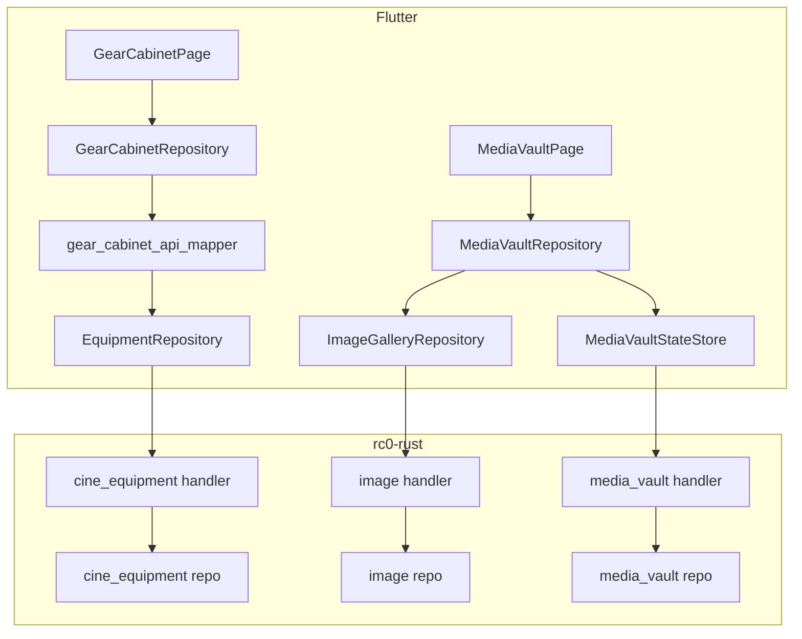

# Gear Cabinet / Media Vault CRUD 实施计划

> 版本：2026-07-07 · PRD：[GEAR_MEDIA_BACKEND_PRD.md](GEAR_MEDIA_BACKEND_PRD.md)

## 1. 架构总览



## 2. Gear Cabinet

### 2.1 可复用 API（已实现）

| 方法 | 路径 | 用途 |
|------|------|------|
| GET | `/cine-equipment/brands` | 品牌筛选 |
| GET | `/cine-equipment/bodies` | 机身列表 |
| GET | `/cine-equipment/lenses` | 镜头列表 |
| GET | `/cine-equipment/setups` | 系统组合 |
| GET | `/cine-equipment/setups/mine` | 我的组合 |
| POST | `/cine-equipment/setups` | 创建组合 |
| PUT | `/cine-equipment/setups/{id}` | 更新组合 |
| DELETE | `/cine-equipment/setups/{id}` | 删除组合 |
| GET | `/cine-equipment/favorites` | 收藏列表 |
| POST | `/cine-equipment/favorites/toggle` | 切换收藏 |

**后端位置**：`rc0-rust/src/handler/cine_equipment.rs` · `repository/cine_equipment/mod.rs`

**前端位置**：`lib/api/cine-equipment/` · `lib/features/cine_equipment/data/equipment_repository.dart`

### 2.2 UI 模型映射（前端 Phase 2）

| API 实体 | Gear 模型 | 分柜规则 |
|----------|-----------|----------|
| `CameraBody` | `GearDevice` @ `GearRoomType.camera` | 按 `brand` 分 Cabinet；每柜按 mount 分 Shelf |
| `Lens` | `GearDevice` @ `GearRoomType.lens` | 按 `brand` 分 Cabinet |
| `CineCameraSetup` | `GearDevice` @ `GearRoomType.accessory` | 单柜「我的组合」+「系统组合」 |
| Lighting | `GearRoomType.lighting` | **暂用** `GearCabinetSampleData` 灯具房 |

**实现文件**：

- `lib/features/gear_cabinet/data/gear_cabinet_api_mapper.dart`（新增）
- `lib/features/gear_cabinet/data/gear_cabinet_repository.dart`（改：API 优先，sample 降级）

### 2.3 待新增 API（Phase 4，可选）

用户自定义布局持久化：

| 方法 | 路径 | 说明 |
|------|------|------|
| GET | `/cine-equipment/layout` | 读取用户柜/架布局 JSON |
| PUT | `/cine-equipment/layout` | 保存布局覆盖 |

**建议表**：`user_gear_cabinet_layout (user_id, room_type, layout_json, update_at)`

## 3. Media Vault

### 3.1 可复用 API（已实现）

| 方法 | 路径 | 用途 |
|------|------|------|
| POST | `/images` | 上传 |
| GET | `/images` | 分页列表 |
| GET | `/images/{id}` | 详情 |
| GET | `/images/{id}/download` | 下载 URL |
| GET | `/image-tags` | 标签池 |
| POST | `/image-tags` | 创建标签 |
| POST | `/images/{id}/tags` | 打标 |
| DELETE | `/images/{id}/tags/{tag_id}` | 去标 |
| GET/POST/DELETE | `/images/{id}/works` | 作品关联 |

### 3.2 待新增 API（Phase 3–4）

#### Albums

| 方法 | 路径 | Body | 响应 |
|------|------|------|------|
| GET | `/media-vault/albums` | — | `AlbumDto[]` |
| POST | `/media-vault/albums` | `{ title, cover_image_id? }` | `AlbumDto` |
| PUT | `/media-vault/albums/{id}` | `{ title?, cover_image_id? }` | `AlbumDto` |
| DELETE | `/media-vault/albums/{id}` | — | `()` |
| POST | `/media-vault/albums/{id}/images` | `{ image_id }` | `()` |
| DELETE | `/media-vault/albums/{id}/images/{image_id}` | — | `()` |

#### Image state

| 方法 | 路径 | Body | 响应 |
|------|------|------|------|
| PATCH | `/media-vault/images/{id}/state` | `{ is_favorite?, in_trash? }` | `ImageStateDto` |
| GET | `/media-vault/images` | `?section=library\|favorites\|trash` | `PageData<ImageResponse>` |

#### Metrics

| 方法 | 路径 | 响应 |
|------|------|------|
| GET | `/media-vault/metrics` | `{ used_bytes, quota_bytes, image_count }` |

### 3.3 建议表结构

```sql
-- media_vault_album
CREATE TABLE media_vault_album (
  id BIGSERIAL PRIMARY KEY,
  creator BIGINT NOT NULL,
  title VARCHAR(256) NOT NULL,
  cover_image_id BIGINT,
  deleted SMALLINT DEFAULT 0,
  create_at TIMESTAMPTZ DEFAULT now(),
  update_at TIMESTAMPTZ DEFAULT now()
);

-- media_vault_album_image
CREATE TABLE media_vault_album_image (
  album_id BIGINT NOT NULL,
  image_id BIGINT NOT NULL,
  sort INT DEFAULT 0,
  PRIMARY KEY (album_id, image_id)
);

-- media_vault_image_state
CREATE TABLE media_vault_image_state (
  image_id BIGINT NOT NULL,
  user_id BIGINT NOT NULL,
  is_favorite BOOLEAN DEFAULT false,
  in_trash BOOLEAN DEFAULT false,
  trashed_at TIMESTAMPTZ,
  PRIMARY KEY (image_id, user_id)
);
```

### 3.4 前端接入顺序

| 步骤 | 文件 | 动作 |
|------|------|------|
| 1 | `media_vault_local_state.dart` | 收藏/回收站本地持久化（过渡） |
| 2 | `media_vault_repository.dart` | 合并 API 列表 + 本地 state |
| 3 | `lib/api/media-vault/` | 新增 API wrapper（album/state/metrics） |
| 4 | 后端 handler 就绪后 | 替换 local state 为 API 同步 |

## 4. OpenAPI 更新清单

在 `rc0-rust/docs/openapi.yaml` 增加 tags：

- `CineEquipment`（补全现有 paths 文档）
- `MediaVault`（album / state / metrics）

同步更新 `docs/06-api-contracts.md` 索引表。

## 5. 分阶段任务

### Phase 1 — 文档（本批次）

- [x] `GEAR_MEDIA_BACKEND_PRD.md`
- [x] `GEAR_MEDIA_CRUD_PLAN.md`
- [x] `refactor/README.md` 索引

### Phase 2 — 前端 Gear API 映射

- [x] `gear_cabinet_api_mapper.dart`
- [x] `GearCabinetRepository` 接 `EquipmentRepository`
- [x] 灯具房 sample 降级策略文档化于代码注释

### Phase 3 — 后端 Media Vault 骨架

- [x] `handler/media_vault.rs` stub handlers
- [x] `router/mod.rs` nest `/media-vault`
- [x] `migrations/xxx_media_vault.sql`
- [x] OpenAPI paths

### Phase 4 — 前端 Media Vault 完整 CRUD

- [x] API client + repository 接 album/state/metrics
- [x] `media_vault_local_state.dart` 收藏/回收站本地持久化（API 失败降级）
- [x] 登录态移除 `MediaVaultSampleData.buildAlbums()` 主路径

### Phase 5 — Gear 布局持久化（可选）

- [x] `GET/PUT /cine-equipment/layout` 后端 + OpenAPI
- [x] `gear_cabinet_layout_codec.dart` + 本地 SharedPreferences 降级
- [x] `GearCabinetRepository` 加载/保存/重排柜子与设备
- [x] 设备库页编辑布局 + 保存按钮

### Phase 6 — Media Vault 永久删除

- [x] `DELETE /media-vault/images/{id}` 软删图片并清理 vault 状态
- [x] 前端 API + `MediaVaultRepository.permanentlyDelete`
- [x] 回收站长按「永久删除」+ 确认对话框

## 6. 测试计划

| 层 | 用例 |
|----|------|
| 前端 mapper | `test/features/gear_cabinet/gear_cabinet_api_mapper_test.dart` |
| 前端 vault | 登录后上传 → 列表可见；收藏切换持久化 |
| 后端 | album CRUD round-trip；state PATCH idempotent |
| 契约 | OpenAPI example 与 integration test 一致 |

## 7. 回滚策略

- Feature flag：`GearCabinetRepository.useApiCatalog`（默认 true，false 回 sample）
- Media Vault：保留 `MediaVaultSampleData` 仅作未登录预览，可随时切回
