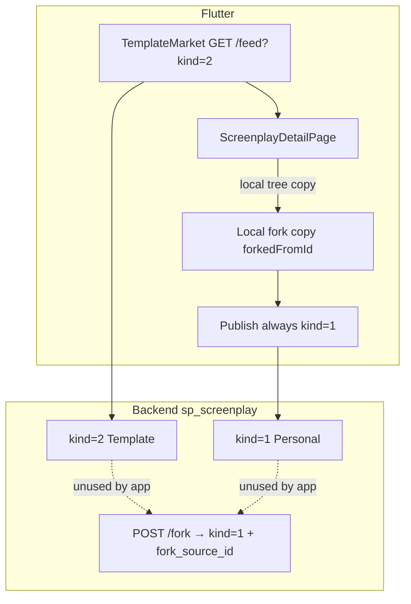
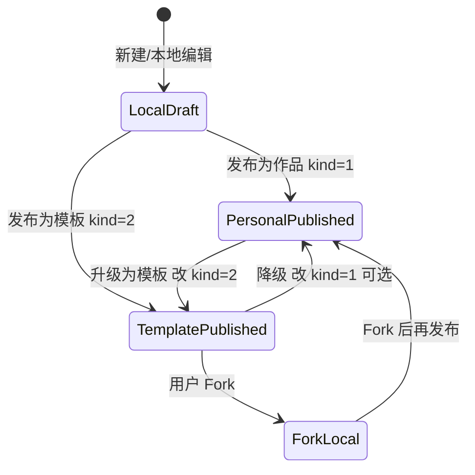

# 剧本 ↔ 模板 · 关系与全链路 PRD

> 版本：v1.0 · 状态：**实施中**（D1–D6 已定稿；Flutter 侧按本稿落地）  
> 用途：按定稿重构前后端逻辑  
> 关联：[PRODUCT_CONCEPT.md](../design/PRODUCT_CONCEPT.md) · [UX_GUIDELINES.md](../design/UX_GUIDELINES.md) · [全栈 PRD](PRD.md) · [SHELL_NAV_PRD.md](SHELL_NAV_PRD.md)  
> 仓库：Flutter `flutter_application_1` · Rust `rc0-rust`

---

## 0. 你改 PRD 时优先拍板的决策（默认已填）


| #   | 决策点       | 本稿默认                                                                             | 你可改成                             |
| --- | --------- | -------------------------------------------------------------------------------- | -------------------------------- |
| D1  | 模板的权威定义   | `kind=2` **+** `publish_status=1`（与 visibility 正交）                               | 仅 visibility=1 / 仅 kind=2 / 二者同时 |
| D2  | 「公开」与「模板」 | **分开**：公开≠进模板市场；进市场必须显式「发布为模板」                                                   | 公开即自动 kind=2                     |
| D3  | Fork 策略   | **混合**：先本地副本可编辑；同步/发布时调用 `POST /fork` 或带 `fork_source_id` 创建                     | 仅本地 / 仅服务端                       |
| D4  | 血缘展示      | 详情页必须展示「翻拍自 {标题}」并可跳转源                                                           | 仅本地 meta / 不做                    |
| D5  | 列表 SSOT   | **只用** `GET /feed?kind=2`（或等价 `GET /templates`）；删除 visibility 假降级                | 保留双源                             |
| D6  | 前端模型      | Flutter `Screenplay` **补齐** `kind` / `forkSourceId` / `forkRootId` / `forkCount` | 继续启发式                            |


> 改完上表后，下文「目标模型 / 目标链路」以你的选择为准重构。

---


## 1. 背景与问题


### 1.1 产品心智（应对齐）

来自 [PRODUCT_CONCEPT](../design/PRODUCT_CONCEPT.md)：

- 剧本是可漫游空间（`Act → Scene → Frame`）。
- **Fork = 剧本的翻拍权**：完整树复制，与原作保持「翻拍自」血缘。
- 飞轮：浏览模板 → Fork 创作 → 沉淀 → 再发布为模板。

Shell 上「模板」已是 L1 入口（`/discovery` 单页模板市场）。

### 1.2 现状一句话

**后端：模板 = 同一张表** `sp_screenplay` **上的** `kind=2`**。**  
**前端：没有** `kind` **字段；市场靠** `GET /feed?kind=2`**；发布永远** `kind=1`**；Fork 只做本地拷贝。**  
结果：用户「公开发布」进不了模板市场；Fork 不涨 `fork_count`；「翻拍自」无 UI。

### 1.3 核心痛点


| 编号  | 痛点                     | 证据                                                                           |
| --- | ---------------------- | ---------------------------------------------------------------------------- |
| T1  | **定义分裂**               | 后端 `kind=2`；前端用「已发布远端且非 fork」启发式当模板；公开用 `visibility=1`                       |
| T2  | **发布进不了市场**            | `ScreenplayPublishService` 固定 `kind: 1`；无「发布为模板」                             |
| T3  | **Fork 双轨**            | App：本地 `forkedFromId`；后端：`POST /fork` + `sp_fork` **未被调用**                   |
| T4  | **列表降级错误**             | 空 feed 时 `GET /screenplays?visibility=1`，后端 **不按 visibility 过滤**，也不强制 kind=2 |
| T5  | **字段未映射**              | Mapper 不读 `kind` / `fork_source_id` / `fork_root_id` / `fork_count`          |
| T6  | **首发 visibility 可能丢失** | `buildSaveTreePayload` 仅 `isRepublish` 时带 visibility                         |
| T7  | **命名债务**               | community 组件/文案/「出现在社区列表」与模板市场并存                                             |
| T8  | **文档错误**               | `docs/06-api-contracts.md` 称 feed kind=2 与 visibility=1 等价                   |


---


## 2. 现状模型（As-Is）


### 2.1 后端实体（权威）

表：`sp_screenplay`（非独立 template 表）


| 字段                                | 含义                                      |
| --------------------------------- | --------------------------------------- |
| `kind`                            | **1** 个人剧本 · **2** 模板 · **3** FramePack |
| `publish_status`                  | **0** 草稿 · **1** 已发布                    |
| `visibility`                      | **0** 私密 · **1** 公开（列表查询今日基本未用）         |
| `template_access` / `price_cents` | 库有，前端未用                                 |
| `fork_source_id`                  | 直接父本                                    |
| `fork_root_id`                    | 血缘根                                     |
| `fork_count`                      | 被 Fork 次数                               |
| `hot_score` / `is_featured`       | 热度 / 精选                                 |


### 2.2 前端实体（As-Is）

`Screenplay`（`lib/core/domain/screenplay/screenplay.dart`）


| 有                                                                              | 无                                                                                |
| ------------------------------------------------------------------------------ | -------------------------------------------------------------------------------- |
| `remoteScreenplayId`、`visibility`、`forkedFromId`、`forkedFromLocalId`、tags、社交计数 | `kind`**、**`forkRootId`**、**`forkCount`**、**`publishStatus`**、**`templateAccess` |


派生：

- `isPublished` ⇔ `remoteScreenplayId != null`
- `isForkCopy` ⇔ 本地 fork 字段非空
- `exploreFeedType.template` ⇔ 已发布远端且非 fork（**≠ kind=2**）


### 2.3 As-Is 关系图




---


## 3. 目标模型（To-Be · 按 §0 默认）


### 3.1 统一定义


| 概念          | 定义                                                                           |
| ----------- | ---------------------------------------------------------------------------- |
| **剧本（个人）**  | `kind=1`；可为草稿或已发布；`visibility` 控制他人是否可见作品页                                   |
| **模板**      | `kind=2` 且 `publish_status=1`；出现在模板市场；可被 Fork                                |
| **Fork 副本** | 新行 `kind=1`（默认可再编辑）；带 `fork_source_id` / `fork_root_id`；本地同步写 `forkedFromId` |
| **公开**      | `visibility=1`；**不自动**变成模板                                                   |


### 3.2 状态机（发布）




### 3.3 前端必补字段

在 `Screenplay` / LocalMeta / ApiMapper 对齐：


| 字段              | 来源                                  |
| --------------- | ----------------------------------- |
| `kind`          | `sp_screenplay.kind`                |
| `forkSourceId`  | `fork_source_id`                    |
| `forkRootId`    | `fork_root_id`                      |
| `forkCount`     | `fork_count`                        |
| `publishStatus` | `publish_status`（可选，可用 remoteId 近似） |


删除或降级：`exploreFeedType` 启发式；改用 `kind == 2`。

---


## 4. 目标全链路（To-Be）


### 4.1 浏览模板 → 详情 → Fork → 创作

```
/discovery (TemplateMarketBody)
  → GET /feed?kind=2&sort=hot|latest&q&tag_id?   【唯一列表源】
  → 卡片展示 forkCount / 作者 / 封面
  → /scripts/:id 详情
  → CTA「Fork 这个模板」
  → 策略 D3 默认：
       1) GET /tree 拉全树
       2) 本地落盘（可立即编辑）
       3) 若已登录：POST /screenplays/{id}/fork（或创建时带 fork_source_id）
       4) 绑定 remoteScreenplayId + 血缘字段
  → 进入 Studio / 本地详情，顶栏展示「翻拍自 {源标题}」
```

**验收：** 源模板 `fork_count +1`；副本可编辑；血缘可点回源模板。

### 4.2 创作 → 发布为作品 / 发布为模板

```
本地剧本
  → 发布 Sheet：
       [ ] 公开可见 visibility
       ( ) 发布为作品  → kind=1
       ( ) 发布为模板  → kind=2   【新增】
  → POST /screenplays { kind }
  → 上传资源 + PUT/POST tree（**首次即带 visibility**）
  → POST /publish
  → 若 kind=2：出现在 /discovery；若仅 visibility=1 且 kind=1：仅作品/主页可见
```

**验收：** 选「发布为模板」后，市场 `kind=2` 列表可见；仅「公开作品」不可见市场。

### 4.3 已发布作品 → 升级为模板

```
详情（owner + kind=1 + published）
  → 「设为模板」
  → PUT /screenplays/{id} { kind: 2 } 或专用 endpoint
  → 刷新市场
```


### 4.4 血缘与「翻拍自」


| 场景         | 行为                         |
| ---------- | -------------------------- |
| 查看 Fork 副本 | 副标题/信息卡：「翻拍自 {title}」→ 跳转源 |
| 源已删/私密     | 文案降级为「翻拍自已失效模板」            |
| 发布 Fork 副本 | 保留 `fork_source_id`；可选展示血缘 |


### 4.5 可见性（与模板解耦）


| visibility | kind=1 | kind=2                              |
| ---------- | ------ | ----------------------------------- |
| 0 私密       | 仅自己    | 不允许上架市场（发布模板时强制 visibility=1 或二次确认） |
| 1 公开       | 作品流/主页 | 模板市场                                |


---


## 5. API 契约（目标 SSOT）


### 5.1 保留并作为主路径


| API                                       | 用途                            |
| ----------------------------------------- | ----------------------------- |
| `GET /feed?kind=2&sort=&q=&tag_id=&page=` | 模板市场唯一列表                      |
| `GET /screenplays/{id}` / `.../tree`      | 详情与树                          |
| `POST /screenplays`                       | 创建；**必须支持 kind=1|2**          |
| `PUT /screenplays/{id}`                   | 更新 visibility / kind（升级模板）    |
| `POST /screenplays/{id}/publish`          | 置 `publish_status=1`（不改 kind） |
| `POST /screenplays/{id}/fork`             | 服务端 Fork（App 必须接入）            |
| `GET /screenplays/{id}/forks`             | 血缘列表（可选 UI）                   |


### 5.2 收敛 / 弃用


| API / 行为                              | 处理                   |
| ------------------------------------- | -------------------- |
| `GET /screenplays?visibility=1` 作模板降级 | **删除**前端 fallback    |
| `docs/06-api-contracts.md` 等价表述       | **改正**               |
| `GET /templates` / `hot` / `featured` | 与 feed 二选一文档化；前端只走一条 |
| 前端不调 `POST /fork`                     | **改为必调**（登录态）        |


### 5.3 后端建议补强（若你采纳 D1）

- `list` / `list_filtered`：可选 `visibility` 过滤（作品流用），与 `kind` 独立。
- `publish`：若请求体带 `as_template: true`，原子设 `kind=2`（或保持 PUT kind 分离，二选一写进定稿）。
- Fork：已实现；确保 OpenAPI 路径补全。

---


## 6. 前端模块改造清单（按定稿实施）


| 模块                                  | 改造                                     |
| ----------------------------------- | -------------------------------------- |
| `Screenplay` + LocalMeta            | 补字段；持久化血缘                              |
| `ScreenplayApiMapper`               | 映射 kind/fork*；`toTreeJson` 禁止写死 kind=1 |
| `ScreenplayPublishService`          | 发布 Sheet 选 kind；首次 tree 带 visibility   |
| `ScreenplayLocalRepository.fork`    | 接 `POST /fork` + 本地缓存                  |
| `ScreenplayDetailPage`              | Fork/发布/升级模板 CTA；翻拍自                   |
| `TemplateMarketRepository`          | 单源 feed；去掉错误 fallback                  |
| `template_*` / `community_*`        | 文案与组件改名「模板」；废弃 community 入口            |
| `ExploreFeedMapper.exploreFeedType` | 改用 kind                                |
| `06-api-contracts.md`               | 与本 PRD 对齐                              |


---


## 7. 非目标

- 不做付费模板结算（`price_cents` 可保留字段不动）。
- 不做独立 template 微服务/新表。
- 不恢复「发现推荐 Feed」为 L1（市场仍是单页模板）。
- 不在本期重做 FramePack（`kind=3`）产品化。

---


## 8. 里程碑建议


### M1 — 契约对齐（阻塞）

- [ ] 前端映射 `kind` / fork 血缘字段
- [ ] 删除错误 visibility fallback；修正 api-contracts
- [ ] 首次发布写入 visibility


### M2 — 发布为模板

- [ ] 发布 Sheet：作品 vs 模板
- [ ] 市场只展示 kind=2
- [ ] 「设为模板」升级路径


### M3 — Fork 全链路

- [ ] 接入 `POST /fork`
- [ ] 详情「翻拍自」
- [ ] fork_count 展示与刷新


### M4 — 命名与清理

- [ ] community → 模板 文案/组件收敛
- [ ] 死代码 ExploreFeed 多 Tab 清理

---


## 9. 验收标准


| #   | 标准                                                    |
| --- | ----------------------------------------------------- |
| A1  | 新「发布为模板」的剧本出现在 `/discovery`；仅「公开作品」不出现                |
| A2  | 市场请求仅为 `kind=2`（或文档指定的 `/templates`），无 visibility 假列表 |
| A3  | Fork 后服务端存在副本且 `fork_source_id` 正确；`fork_count` 增加    |
| A4  | Fork 详情可见「翻拍自」并跳转源                                    |
| A5  | Flutter 模型可读 `kind`；卡片徽章不靠错误启发式                       |
| A6  | 旧链 `/community`、`/discovery?section=template` 仍进市场    |
| A7  | 回归：本地草稿编辑、个人发布、私密作品不被市场抓取                             |


---


## 10. 风险


| 风险                   | 缓解                                 |
| -------------------- | ---------------------------------- |
| 历史 `kind=1` 公开数据不在市场 | 迁移脚本或运营「批量升模板」；或临时双条件（需你改 D1）      |
| 仅本地 Fork 的旧副本无服务端血缘  | 发布时补写 `fork_source_id`；无法补则只显示本地血缘 |
| 双写 fork（本地+服务端）冲突    | 以服务端 id 为准，本地 meta 跟随              |


---


## 附录 A · 关键代码锚点

**后端**

- `rc0-rust/src/model/screenplay/screenplay.rs`
- `rc0-rust/src/repository/screenplay/screenplay.rs`（`fork_screenplay`）
- `rc0-rust/src/handler/screenplay.rs` / `feed`
- `rc0-rust/docs/openapi.yaml`

**前端**

- `lib/core/domain/screenplay/screenplay.dart`
- `lib/features/screenplay/data/screenplay_api_mapper.dart`
- `lib/features/screenplay/data/screenplay_publish_service.dart`
- `lib/features/screenplay/data/screenplay_local_repository.dart`
- `lib/features/screenplay/presentation/pages/screenplay_detail_page.dart`
- `lib/features/explore/data/template_market_repository.dart`
- `lib/features/explore/presentation/widgets/template_market_body.dart`
- `docs/06-api-contracts.md`


## 附录 B · As-Is 用户旅程摘要

1. **逛市场**：`/discovery` → feed kind=2 → 详情 → **本地** Fork → 本地剧本。
2. **发布**：本地 → 可见性对话框 → **永远 kind=1** → 难进市场。
3. **翻拍自**：数据可能在本地 meta，**无 UI**。

---


## 附录 C · 修改记录（给你填）


| 日期         | 修改人   | 变更               |
| ---------- | ----- | ---------------- |
| 2026-07-09 | Agent | 初稿 v1.0，默认 D1–D6 |
| 2026-07-09 | Agent | 状态改为实施中；Flutter 按 D1–D6 落地 |


