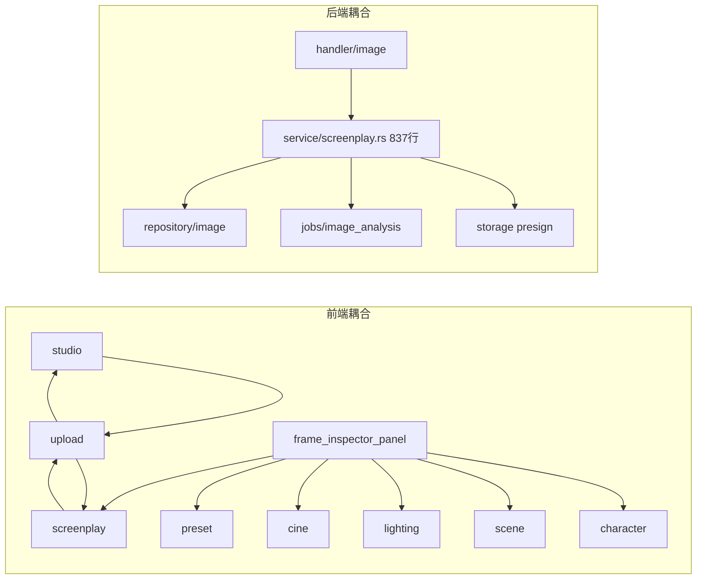
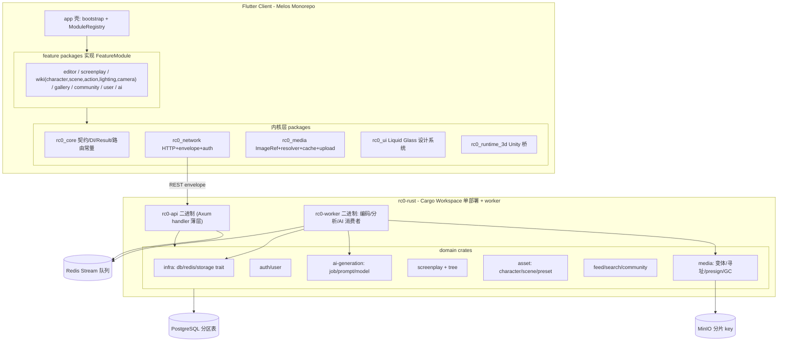
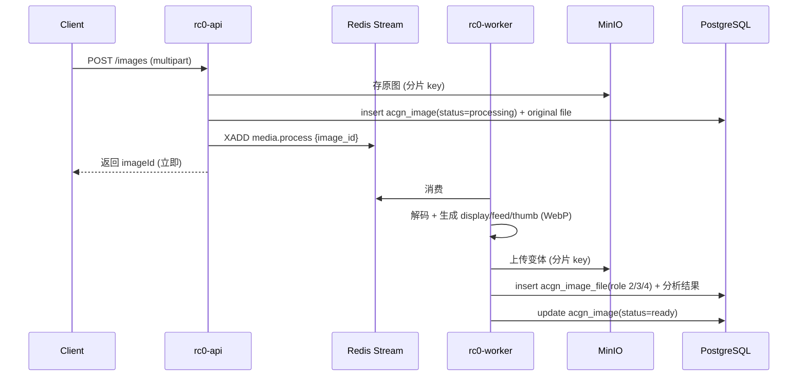
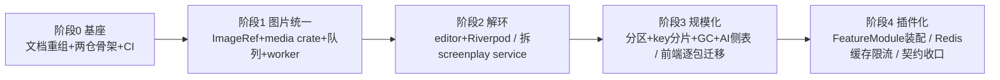

# rc0 全栈重构 · 技术方案文档

> 版本：v1.0 · 状态：草案（待评审）
> 关联：[PRD](PRD.md) · 前端仓库 `C:/Users/qianlNya/flutter/flutter_application_1` · 后端仓库 `C:/Users/qianlNya/RustroverProjects/rc0-rust`
> 说明：本方案基于两仓真实代码审阅。文中前端路径相对前端仓库根，后端路径以 `rc0-rust/` 前缀标注。

---

## 1. 现状架构（真实）

### 1.1 前端 Flutter
- 分层：`lib/app`（壳/路由/主题） · `lib/api`（手写 HTTP 客户端两层：`api/` 传输 + `data/` DTO） · `lib/core`（config/domain/network/services/...） · `lib/features/*`（28 个 feature，data/domain/presentation） · `lib/shared`（通用 UI） · `lib/runtime_3d` + `packages/rc0_unity_widget` + `unity/rc0_runtime`（3D 三层桥）。
- 状态管理：27 个 `ChangeNotifier`，24 个 singleton `.instance` repository，`main.dart` 启动时 eager init；页面用 `addListener/setState` 或 `ListenableBuilder`。
- 模型：全部手写 `fromJson/toJson`，无 freezed/json_serializable。
- 路由：go_router，7 个 shell branch，约 66 条 `GoRoute`（含约 13 条 legacy redirect）。

### 1.2 后端 Rust（rc0-rust）
- 单 crate Axum 0.8 单体，分层 `handler → service → repository → model`，另有 `dto / storage / image_processing / jobs / auth / middleware / cache / common`。
- DI：无框架，依赖集中在 `AppState { settings, db(PgPool), redis, storage: Arc<dyn ObjectStorage>, blob: Arc<dyn BlobService>, rbac }`。
- 数据：33 张表，统一审计+软删字段；剧本树 `sp_screenplay→sp_act→sp_scene→sp_frame`。
- 图片：`POST /images` 请求内同步生成 3 个 WebP 变体 → MD5 内容寻址 `{md5}.webp`（扁平桶）→ 每图 3 个对象 + 3 行 `acgn_image_file`；分析用进程内 `tokio::spawn`。
- Redis：仅 refresh token；缓存/队列/限流均未落地。

### 1.3 核心痛点定位（代码级）


---

## 2. 目标架构总览



**依赖铁律（CI 校验）**：
- 前端：feature 只依赖 kernel 与自身；feature 间禁止互相 import 实现；`rc0_ui` 不依赖任何 feature；kernel 不含业务。
- 后端：handler 不写 SQL/不直连 repository；跨域仅经 service；repository 不跨域。

---

## 3. 前端技术方案

### 3.1 工程形态：Melos monorepo
`lib/` 拆分为多个包，`app/` 仅做壳：
```text
packages/
  rc0_core/         # 契约、Result、Riverpod provider 边界、路由常量、FeatureModule 接口、端口(Port)定义
  rc0_network/      # HTTP client、envelope 解析、auth header、401 处理
  rc0_media/        # ImageRef、ImageResolver、Rc0Image、MediaUploadService、缓存
  rc0_ui/           # Liquid Glass 设计系统(含现 studio 泄漏的 header/glass/theme)
  rc0_runtime_3d/   # 现 lib/runtime_3d 迁入；依赖现 packages/rc0_unity_widget
  rc0_feature_editor/    # 现 upload(57 UI) + studio 编排 合并
  rc0_feature_screenplay/# 纯数据/领域：树模型+草稿+发布 service
  rc0_feature_wiki/      # character/scene/action/lighting/camera 可插拔
  rc0_feature_gallery/
  rc0_feature_community/
  rc0_feature_user/
  rc0_feature_ai/
app/                # main.dart、ProviderScope、ModuleRegistry 装配、根路由
```

### 3.2 状态管理：Riverpod + codegen
- 依赖：`flutter_riverpod` / `riverpod_annotation` / `riverpod_generator` / `freezed` / `json_serializable` / `build_runner`。
- 迁移映射：`XxxRepository extends ChangeNotifier`（singleton `.instance`）→ `@riverpod class Xxx extends _$Xxx`（`Notifier`/`AsyncNotifier`）。
- 访问点：`Xxx.instance.method()` → `ref.read(xxxProvider.notifier).method()`；`addListener/setState` → `ref.watch`。
- `main.dart` eager init → `ProviderScope(overrides: [...])`，需要预热的用 `ref.read` 触发或 `@Riverpod(keepAlive: true)`。
- 模型：手写 `fromJson/toJson` → `@freezed` + `@JsonSerializable`，codegen 生成。
- 过渡策略：允许 ChangeNotifier 与 Riverpod 共存，用 `ChangeNotifierProvider` 包裹旧 repo，逐包替换，避免大爆炸迁移。

### 3.3 解耦：拆 studio/upload/screenplay 环（P2 最高优先）
- 新建 `rc0_feature_editor`：吸收 `upload`（实为脚本编辑器，命名误导）全部 57 个 presentation 文件 + `studio` 编排层（`screenplay_editor_host.dart` 等），成为编辑器唯一 owner。
- `rc0_feature_screenplay` 收敛为纯数据/领域：树模型、`ScreenplayDraft`、发布/同步/本地化 service，不再持有 UI widget。
- 打破 `ScreenplayDraft ↔ UploadImageFile` 循环：`UploadImageFile` 上移为 `rc0_media` 的 `LocalMediaFile`。
- 打破 god widget：`frame_inspector_panel` 对 character/scene/lighting/cine_equipment/preset 的直接依赖 → `rc0_core` 端口：
```dart
// rc0_core/ports.dart
abstract interface class ScenePickerPort { Future<SceneRef?> pickScene(BuildContext ctx); }
abstract interface class CharacterPickerPort { Future<CharacterRef?> pickCharacter(BuildContext ctx); }
abstract interface class PresetPort { Future<PresetRef?> pickPreset(BuildContext ctx, PresetScope scope); }
```
由 app 壳在 `ModuleRegistry` 注入各 feature 实现，编辑器只依赖端口。
- 迁移 `script_studio_header_components` / `script_studio_glass_widgets` / `script_studio_theme` 到 `rc0_ui`，停止 10+ 跨 feature presentation import。

### 3.4 页面/死代码治理（P4）
- 删除空目录：`home` `reply` `monitor` `pose` `pose_detail`。
- 收敛 stub：`social` 折入 `user`；`tasks` + `messages` 合并为 `notifications`（明确 coming_soon）。
- 路由常量收敛到 `rc0_core`；各 feature 通过 `FeatureModule.routes` 贡献；legacy redirect 保留必要项，其余下线。

### 3.5 插件化（P6）
```dart
// rc0_core/feature_module.dart
abstract interface class FeatureModule {
  String get id;
  List<RouteBase> get routes;
  List<NavEntry> get navEntries;
  void registerProviders(ProviderContainer container);
  Map<Type, Object> get ports; // 提供/消费的端口实现
}
```
- app 壳维护 `ModuleRegistry`（参考后端/Unity 现有 ModuleRegistry 思路），启动时收集所有模块的路由、导航项、provider override、端口绑定。
- 新增能力 = 新增一个 `rc0_feature_*` 包并在壳注册，内核与其他模块零改动。

---

## 4. 后端技术方案（rc0-rust）

### 4.1 Cargo workspace 化（编译期解耦，单体部署）
```text
rc0-rust/
  Cargo.toml            # [workspace] members
  crates/
    infra/              # PgPool、RedisPool、ObjectStorage/BlobService trait、Settings
    common/             # AppError、ApiResponse envelope、pagination
    auth/               # JWT、Argon2、Casbin、user、rbac
    media/              # 变体生成、内容寻址、presign、去重、GC、image 表
    screenplay/         # sp_* 树、fork、tree 解析/持久化
    asset/              # character、scene、cine_preset、cine_equipment、production_asset
    feed/               # feed、search、community(like/favorite/comment)
    ai_generation/      # generation_job、prompt/model/seed、回写
  bin/
    api.rs              # rc0-api：Axum 路由 + handler 薄层
    worker.rs           # rc0-worker：Redis Stream 消费者
```
- 保持单体部署：`rc0-api` 承载全部 HTTP；`rc0-worker` 独立进程消费队列。二者共享上述 crate。

### 4.2 拆 god module（P2）
- `service/screenplay.rs`（837 行）拆分：
  - `ScreenplayService`：剧本 CRUD、发布、engagement。
  - `ScreenplayTreeService`：`resolve_tree` + 持久化（现逻辑在 `repository/screenplay/tree.rs`）。
  - 图片职责（下载、`retry_analysis`、封面上传）**迁出**到 `media::MediaService`。
- `repository/screenplay/extra.rs`（773 行）按 filtering / community / featured / fork 拆子模块。
- 补齐分层：为 character/scene/community/cine_equipment/production_asset/work 增加 service 层；`handler/image.rs`、`handler/character.rs`、`handler/scene.rs` 不再直连 repository。

### 4.3 media 子系统重构（P1 + P3 核心）
- 上传改异步：

- 内容寻址 key：`{md5}` → `{md5[0:2]}/{md5[2:4]}/{md5}.ext` 分片前缀。
- `acgn_image_file` 增引用计数；GC 定时任务清理孤儿对象。
- 统一 presign：现散在 `service/screenplay::image_download_url` 与 `frame_download_url` → 收敛到 `media` crate；前端只存 `imageId`/`fileId`，展示 URL 由服务端签发（可接 CDN）。

### 4.4 AI 生成图（P3）
- 新增侧表（不污染 `acgn_image`）：
```sql
create table acgn_generation_job (
  id            bigserial primary key,
  user_id       bigint not null,
  prompt        text not null,
  negative      text,
  model         varchar(128) not null,
  seed          bigint,
  params        jsonb not null default '{}',
  status        smallint not null default 0,  -- queued/running/done/failed
  cost_cents    bigint not null default 0,
  image_id      bigint,                        -- 完成后回写 acgn_image.id
  error_msg     text,
  -- 审计+软删字段同其他表
  create_at timestamptz not null default now()
);
```
- `acgn_image` 增 `generation_job_id`（可空，弱关联）。
- 生成任务复用 media 队列 + worker：投递 → 调用生成 → 回写图片 → 触发变体/分析。

### 4.5 规模化（P3）
- 分区：`acgn_image` / `acgn_image_file` / `acgn_image_analysis` 按 `create_at` 做时间分区（PostgreSQL 声明式分区）。
- 消除 N+1：`image::list` 批量加载 files（`WHERE image_id = ANY($1)` 聚合）。
- 连接池：`max_connections` 从硬编码 10 提为可配置并压测。
- Redis 升级：落地 `docs/ARCHITECTURE.md` 已规划的 media/AI 队列（Stream）、热点 feed/screenplay 缓存、`rate:{ip}:{path}` 限流。

---

## 5. 数据模型重规划（P5）

### 5.1 统一图片引用 ImageRef（端到端契约）
- 定义（当前以本文为权威；阶段 0 后可拆分为 `docs/05-media-assets.md`）：
```jsonc
// ImageRef 逻辑模型
{
  "image_id": 123,        // acgn_image.id，主标识
  "file_id": 456,         // acgn_image_file.id（指定变体角色）
  "remote_url": "https://cdn/.../ab/cd/<md5>.webp", // 读时由服务端签发/回填，可空
  "local_path": "/app/.../frame-1.webp"             // 仅客户端本地草稿态，可空
}
```
- 后端 `sp_frame` 现三重字段（`image_url`/`thumbnail_url`/`acgn_image_id`/`acgn_image_file_id`）→ 规范化以 `acgn_image_file_id` 为主键；URL 读时生成。
- 前端约 9 种方案（id / file_id+role / url / 本地路径 / ref / 缓存路径 / asset 等）→ 收敛为单一 `ImageRef` freezed sealed 类型。
- tree save 的 `TreeAssetEntry`（`kind/remote_url/remote_image_id/remote_image_file_id`）映射到 `ImageRef`，不再并行两套。

### 5.2 剧本树
- 保留 `sp_screenplay→sp_act→sp_scene→sp_frame` 及 fork 单事务语义（后端成熟，改动风险高、收益低）。
- 前端 `core/domain/screenplay` 规范树语义保留，序列化改为 freezed codegen；本地草稿 JSON 结构保持兼容（迁移脚本处理 ImageRef 字段）。

### 5.3 兼容策略
- 后端读接口在过渡期继续回填 `image_url/thumbnail_url`，客户端优先读 `ImageRef`。
- 双写下线后再移除冗余列（独立迁移，不阻塞功能）。

---

## 6. API 契约（P1/P5 对齐）
- 保持 envelope `{code,message,data}`、`code==0` 成功、Bearer + refresh、无 `/api` 前缀（前端已成熟）。
- 单一契约来源：后端 `C:/Users/qianlNya/RustroverProjects/rc0-rust/docs/openapi.yaml` 与真实 handler/service 代码；前端 `docs/API_COVERAGE.md`、`docs/APP_API_MATRIX.md` 仅保留为 legacy-reference。
- 变更点（向后兼容）：
  - `POST /images` 返回 `image_id`，`status=processing`；新增 `GET /images/{id}` 反映变体就绪状态。
  - 新增 AI 生成任务接口（`POST /ai/generations`、`GET /ai/generations/{id}`）随 `ai_generation` crate 落地。
  - 下载/presign 统一由 media crate 提供，语义不变。

---

## 7. 文档与 Agent 规则落地

### 7.1 当前已收敛文档
- `docs/README.md`：文档总入口，标记权威文档与 legacy/reference 文档。
- `docs/refactor/PRD.md`：产品需求权威入口。
- `docs/refactor/TECHNICAL_DESIGN.md`：技术方案权威入口。

### 7.2 后续阶段 0 文档清理
- 将旧架构、剧本树、API、Runtime 文档合并为编号化文档前，不删除原文件；先由 `docs/README.md` 标记状态。
- 若需要真正 archive，应使用 `git mv docs/<old>.md docs/archive/<old>.md` 保留历史，不直接删除。
- 新增 Cursor Agent 规则应放入 `.cursor/rules/*.mdc`，并保持单条规则聚焦、可执行。

---

## 8. 迁移方案与成本

### 8.1 保留 / 替换（前端）
- 保留（低成本）：`lib/api/*` 两层契约（补 codegen）、`core/domain/screenplay` 语义、`runtime_3d` 三层桥、go_router、Liquid Glass 设计系统。
- 替换（中成本）：ChangeNotifier → Riverpod（24 repo 逐包，可共存过渡）；手写 model → freezed。
- 替换（高成本）：图片 9 方案 → 单 `ImageRef`（触及树序列化/上传/发布/显示 + 旧草稿迁移脚本）；studio/upload/screenplay 拆环（编辑器最大模块，需回归）。

### 8.2 保留 / 替换（后端）
- 保留（低成本）：分层骨架 + `docs/ARCHITECTURE.md`、`ObjectStorage`/`BlobService` trait、envelope、JWT/Argon2/Casbin、`sp_*` 树与 fork、MD5 寻址思路。
- 替换（中成本）：补 service 层 + handler 不直连 repo（面广机械）；单 crate → workspace（接口不变）。
- 替换（高成本）：拆 `service/screenplay.rs` + 图片同步编码/进程内分析 → media crate + 队列 + `rc0-worker`（新增部署单元、队列可靠性）；分区 + key 分片 + 引用计数 GC（**数据迁移**，双读兼容/后台 rekey）；AI 生成侧表（新迁移，向后兼容）。

### 8.3 数据迁移要点
- 旧本地草稿：一次性脚本把散落图片字段折叠为 `ImageRef`。
- 存量 MinIO 对象：后台 rekey 到分片前缀 + `acgn_image_file.object_key` 更新，读时双兼容旧/新 key。
- 分区表：新建分区表 + 后台回填 + 视图切换，或 `pg_partman` 渐进迁移。

---

## 9. 分阶段落地



| 阶段 | 前端 | 后端 | 可回滚点 |
|---|---|---|---|
| 0 | melos 骨架、依赖 CI、文档重组 | workspace 骨架、分层 CI、文档收敛 | 骨架不影响运行时 |
| 1 | `rc0_core/ui/network/media` + `ImageRef` | `media` crate + Redis 队列 + `rc0-worker` | 上传保留同步回退开关 |
| 2 | `rc0_feature_editor` + Riverpod(编辑器) | 拆 `service/screenplay.rs` + 补 service | 编辑器新旧路由并存 |
| 3 | Wiki/图库/社区/用户迁移 + 死代码清理 | 分区/分片/GC/AI 侧表 | 双读兼容、分区视图切换 |
| 4 | `FeatureModule` 装配 + 路由收敛 | Redis 缓存/限流 + 契约收口 | 模块可逐个下线 |

---

## 10. 风险与回滚
| 风险 | 缓解 | 回滚 |
|---|---|---|
| ImageRef 前后端协同发布 | 后端回填旧字段 + 双写 | 关闭双写，读旧字段 |
| worker 队列可靠性 | Stream 消费确认 + 重试 + 死信 | 保留请求内同步编码开关 |
| 图片数据迁移出错 | 后台 rekey + 双读兼容 | 停迁移，读旧 key |
| 编辑器解环回归 | 回归用例先行 + 新旧并存 | 路由切回旧编辑器 |
| Riverpod 迁移工作量 | 逐包 + 共存 | 单包回退到 ChangeNotifier |

---

## 11. 附录：关键文件索引
- 前端图片：`lib/core/domain/screenplay/screenplay_image_resolver.dart`、`lib/shared/widgets/rc0_image.dart`、`lib/features/screenplay/data/data_upload_repository.dart`、`screenplay_image_upload_service.dart`、`screenplay_publish_service.dart`。
- 前端编辑器环：`lib/features/studio/presentation/screenplay_editor_host.dart`、`lib/features/studio/presentation/widgets/frame_inspector_panel.dart`、`lib/features/screenplay/data/screenplay_draft.dart`、`lib/features/upload/domain/upload_image_file.dart`。
- 后端图片：`rc0-rust/src/service/image.rs`、`src/image_processing/pipeline.rs`、`src/image_processing/encode.rs`、`src/storage/object_storage.rs`、`src/storage/minio.rs`、`src/jobs/image_analysis.rs`。
- 后端 god module：`rc0-rust/src/service/screenplay.rs`、`src/repository/screenplay/tree.rs`、`src/repository/screenplay/extra.rs`、`src/dto/screenplay_tree.rs`。
- 后端数据：`rc0-rust/migrations/20250622000000_init.sql`、`rc0-rust/docs/ARCHITECTURE.md`。
